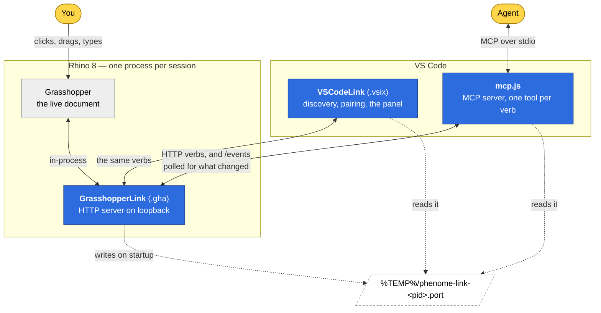
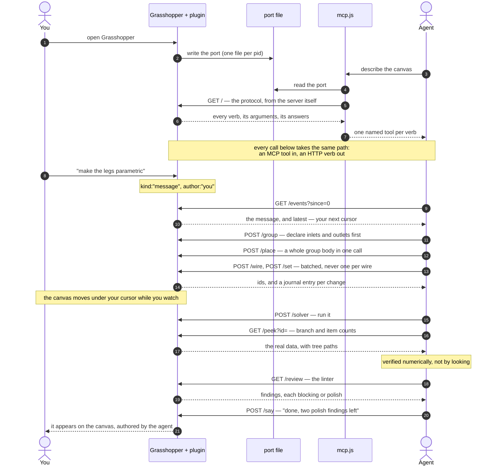

# Phenome Link

Your Grasshopper canvas over loopback HTTP, so an agent can work on it beside you. Two halves of one
mechanism, and they only work as a pair.

| | |
|---|---|
| [`src/Phenome.Apps.GrasshopperLink`](src/Phenome.Apps.GrasshopperLink) | The canvas end: a Grasshopper plugin that exposes the live document, and verbs to edit it. |
| [`src/Phenome.Apps.VSCodeLink`](src/Phenome.Apps.VSCodeLink) | The editor end: a VS Code extension carrying an MCP server, so an agent speaks the protocol as named tools rather than raw HTTP. |

**It stands alone.** No account, no service, no library of ours, and nothing leaves your machine — the server
listens on loopback only. The protocol is worth the same to any Grasshopper user with any agent, which is why
it is MIT and why it is here rather than bundled into something larger.

## What the link is for

A Grasshopper definition is hard to work on together, because one person has the canvas and everyone else
has a description of it. The link removes the description: the document, its wires, its data and its
solver state are readable over HTTP, and the same verbs that read it can edit it. The window and the agent
end up peers — both are clients, neither owns the session.

- **Look** — the document as JSON or as a mermaid flowchart, one object's real parameters, every wire, a
  parameter's full data with tree paths, the installed component catalogue, a linter, the canvas as a
  picture, the Rhino viewport.
- **Build** — place a whole group body in one call, wire and set in batches, group, plant a group's
  signature as floating parameters, lay the graph out, delete (it refuses when that would cut live wires),
  select, zoom, undo and redo.
- **Run and keep** — the solver, bake, data mapping, new/open/save, a C# component's source with its
  compile errors back.
- **Say** — messages both ways, and a friction log for when a verb fights you.

Everything that happens is appended to a journal with an author on every entry, so a client polls for what
changed and skips its own echo. `GET /` describes the whole protocol and is generated from the server
itself, which makes it the authority rather than this file.

## How it fits together

Four parts, and the arrows are the whole design. Everything crosses process boundaries as HTTP on loopback
or as MCP over stdio — there is no shared memory, no database, and nothing off the machine.



Three things follow from that shape, and they are the reasons it is shaped that way:

**The canvas is the only source of truth.** The plugin holds no model of the document; every read walks the
real Grasshopper objects. So an agent and a human cannot drift apart — there is nothing to drift from.

**Clients are peers, and none of them owns the session.** The window and the agent use the same verbs over
the same protocol. Neither can do something the other cannot see, because everything either does lands in
the journal with an author on it.

**A port file per Rhino is the whole of discovery.** No registry, no daemon, no fixed port. Several Rhinos
can run at once and each agent can be pinned to one of them; a stale file has a dead pid, and no file means
no session.

## A session, end to end

What actually travels, from a cold start to a checked result:



Every entry in that journal carries an author, so a client skips its own echo and sees only what somebody
else did. `GET /events?since=N` answers with a `latest` to use as the next cursor — and a gap below your
cursor means entries were dropped, which is the signal to re-read `/canvas` instead of guessing.

## Installing

You need **Rhino 8** on Windows, **VS Code**, **Node.js**, and an **agent that speaks MCP** — Claude Code,
or whatever you already use.

No account anywhere, and nothing leaves the machine: the server listens on loopback only.

Install both halves. They are built to work as a pair.

### From the release (recommended)

Download the newest [release](https://github.com/theObjectCo/Phenome/releases).

**The `.yak`** is the Rhino package. In Rhino, run the `PackageManager` command, then *Install from file*
and pick it — the `.vsix` rides inside, so the canvas's **Pair with VS Code** button can install the editor
half for you on the first pairing.

**Or place the files yourself**, which is the same thing done by hand:

1. Copy `Phenome.Apps.GrasshopperLink.gha` into `%APPDATA%\Grasshopper\Libraries\`, then right-click it,
   Properties, and **Unblock**. Windows marks files that arrived from elsewhere and Grasshopper refuses a
   blocked assembly *silently* — this is the step everybody misses, and the symptom is simply that no
   Phenome components appear.
2. `code --install-extension phenome-link-<version>.vsix`

### From source

Needs the .NET SDK, Rhino 8 and Node.js:

```powershell
pwsh tools/build.ps1
```

That leaves both halves in `dist/`; install them as above.

### Then, either way

Restart Rhino and open Grasshopper. The plugin picks an ephemeral port and writes it to
`%TEMP%\phenome-link-<pid>.port` — one file per Rhino, so several sessions can run at once and each agent
can have a canvas of its own.

**To check it is alive**, with a Grasshopper window open:

```powershell
Get-Content (Get-ChildItem $env:TEMP -Filter 'phenome-link-*.port')[0].FullName
curl http://127.0.0.1:<that port>/
```

A description of the whole protocol comes back. No port file means the plugin did not load — which on a
fresh install is almost always step 1 above.

## Talking to it

Any HTTP client is a peer:

```
curl http://127.0.0.1:<port>/            # the protocol, in full
curl http://127.0.0.1:<port>/canvas      # the document
```

From an agent, the MCP server is the better door: it wraps every verb as a named tool, so a session asks
for permission once per verb instead of once per call. Point your client at `mcp.js` in the extension, or
let the extension launch the agent for you — it pins the session to one canvas through an environment
variable.

**Writing your own client?** [docs/protocol.md](docs/protocol.md) covers what the generated description
cannot: how sessions are discovered, how the journal's cursor and its gaps behave, and the handful of rules
every verb shares.

## When a verb fights you

The plugin keeps a **friction log** — every refused request, with what was asked and what it said back, plus
anything an agent chose to report. It lives at:

```
%LOCALAPPDATA%\Phenome\link-friction.jsonl
```

It is written locally and **nothing is ever sent from the plugin**. Reading it back is `GET /friction`, or
`POST /feedback`, which assembles the session, the linter's findings and the recent friction into one
readable file and hands you a `mailto` link with everything filled in. Sending stays your act, from your own
mail client, after you have read what it says.

**If you would like us to look at it, send that file to
[hi+phenomelogs@object.pl](mailto:hi+phenomelogs@object.pl).**
It is the most useful thing anybody can send us: a verb that refused a reasonable request is a design fault
on our side, and the log says exactly which request, against which version, in which order — the part that
never survives being retold.

Read it before you send it. It records the requests made against your canvas, so it can name components and
files from the definition you were working on. It contains no geometry and nothing about your machine beyond
the plugin's own version.

## Licence

MIT. See [LICENSE](LICENSE).
