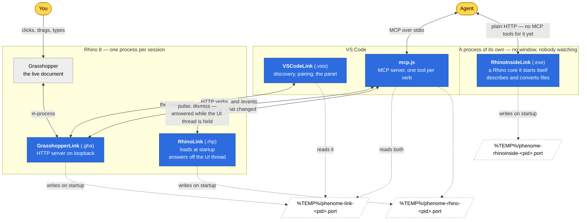
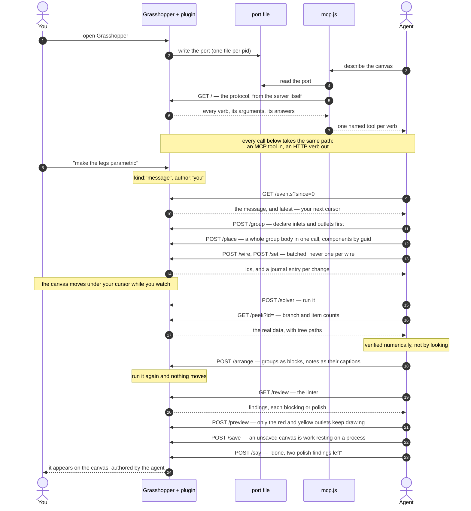
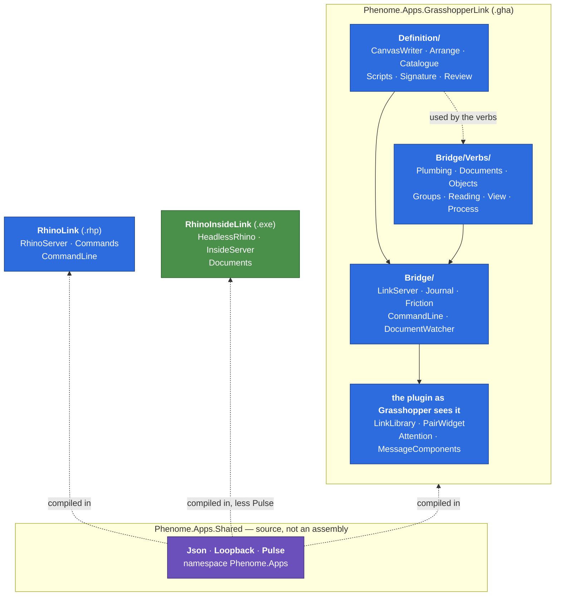

# Phenome Link

Your Grasshopper canvas over loopback HTTP, so an agent can work on it beside you. Three parts of one
mechanism, versioned together.

| | |
|---|---|
| [`src/Phenome.Apps.GrasshopperLink`](src/Phenome.Apps.GrasshopperLink) | The canvas end: a Grasshopper plugin that exposes the live document, and verbs to edit it. |
| [`src/Phenome.Apps.RhinoLink`](src/Phenome.Apps.RhinoLink) | The Rhino end: a plugin that loads with Rhino itself and answers about the process — whether it is free, what is blocking it, and how to answer that. |
| [`src/Phenome.Apps.VSCodeLink`](src/Phenome.Apps.VSCodeLink) | The editor end: a VS Code extension carrying an MCP server, so an agent speaks the protocol as named tools rather than raw HTTP. |

**It stands alone.** No account, no service, no library of ours, and nothing leaves your machine — the server
listens on loopback only. The protocol is worth the same to any Grasshopper user with any agent, which is why
it is MIT and why it is here rather than bundled into something larger.

## What the link is for

A Grasshopper definition is hard to work on together, because one person has the canvas and everyone else
has a description of it. The link removes the description: the document, its wires, its data and its
solver state are readable over HTTP, and the same verbs that read it can edit it. The window and the agent
end up peers — both are clients, neither owns the session.

- **Look** — the document as JSON or as a mermaid flowchart, one object's real parameters, every wire, a
  parameter's full data with tree paths, the installed component catalogue, a linter, the canvas as a
  picture, the Rhino viewport, where the camera stands, and what plugins are loaded. A note answers with
  its wording as it actually reads, the rectangle it covers and the group it is about — so an agent can
  check its own comment landed instead of asking somebody to look at the screen.
- **Build** — place a whole group body in one call, wire and set in batches, group, plant a group's
  signature as floating parameters, lay the graph out, delete (it refuses when that would cut live wires),
  select, zoom, undo and redo. The layout takes the notes with it: a note in a group becomes that group's
  caption, a note in none becomes the document's title, and running the layout twice changes nothing.
- **Run and keep** — the solver, bake, data mapping, new/open/save, a C# component's source with its
  compile errors back. Quiet the preview when the scaffolding is hiding the product — the whole document on
  the colour rule, or one group, or one component whose intermediate output is flooding the viewport. An
  agent's edit marks the document modified, like anybody else's, so closing Rhino offers to save it rather
  than discarding the work in silence.
- **Say** — messages both ways, and a friction log for when a verb fights you.
- **Get unstuck** — whether Rhino is idle, busy or blocked; what dialog is holding it and how to answer
  that; and the tail of Rhino's own command line, which is where commands and scripts reply.

## When the canvas is not the problem

Every verb above runs on Rhino's UI thread, so whenever that thread is not free they all fail the same
way. Two situations hide behind that and they want opposite responses: a long command is worth waiting
for, and a modal dialog will wait forever. An agent that cannot tell them apart either abandons work that
was about to finish, or watches a process that will never move.

So a second, smaller server answers about the process, from a thread of its own:

- **`pulse`** — `idle`, `busy` or `blocked`. Busy names the running command and how long it has run.
  Blocked names the dialog and lists its buttons — or says it has none that can be clicked, which is the
  case for Rhino's newer dialogs: they draw their own, so there is nothing to post a click to.
- **`dismiss`** — presses a button, types a key, or closes the dialog. Closing is the default because
  closing is what the X does and what the X does is decline; agreeing to something has to be asked for.
- **`escape`** — the case `dismiss` cannot answer. A command waiting on a pick is not a dialog: nothing is
  disabled and there is no window to click, yet the thread is held all the same. Scripting an interactive
  command is the ordinary way to get there.
- **`console`** — the tail of the command line. It has been one-way until now: the link writes a line into
  it on every request so the human can see an agent's hands move, and nothing came back. But that is where
  Rhino answers.

This half lives in the Rhino plugin rather than the Grasshopper one, because a `.gha` does not exist until
Grasshopper has been started — so nothing in it can report on a dialog that appears while Rhino is still
starting, which is exactly when nothing else can answer either.

## And a Rhino nobody opened

There is a third one, a program rather than a plugin: it starts a Rhino core in its own process with no window
and answers about files on disk, since there is no document anybody is looking at. Useful on a machine nobody
is sitting at — describe a `.3dm`, or convert one to `.stl`, `.obj`, `.dxf` or `.step`. It is not part of the
pair anybody installs, so it is built from source rather than shipped in a release.

Rhino commands do not run there, and that is measured rather than assumed: `RunScript` answers false in a
windowless core and changes nothing, whether the document was opened headless or the ordinary way. So the verbs
are describing and converting, and anything that is a command belongs in a real Rhino through the plugin above.

```powershell
dotnet run --project src/Phenome.Apps.RhinoInsideLink
```

It prints the port it bound and writes it to `%TEMP%\phenome-rhinoinside-<pid>.port`. `GET /` describes the
protocol and `POST /quit` ends it.

## You can see when it is not you

While an agent is working, every Rhino viewport and the Grasshopper canvas carry a two-pixel border in
Object Orange. It goes out a few seconds after the agent's last action, so an idle screen never wears it,
and the heartbeat a paired client sends does not count as an action — otherwise the border would mean
"somebody is connected", which is a light nobody looks at after the first hour.

Drawn rather than announced. A dialog has to be dismissed and a line in the command history scrolls away;
a border is seen without being read.

Everything that happens is appended to a journal with an author on every entry, so a client polls for what
changed and skips its own echo. `GET /` describes the whole protocol and is generated from the server
itself, which makes it the authority rather than this file.

## How it fits together

Six parts, and the arrows are the whole design. Everything crosses process boundaries as HTTP on loopback
or as MCP over stdio — there is no shared memory, no database, and nothing off the machine.



The sixth part is the newest and the odd one out: it is not installed, it is not part of the pair, and the
MCP layer has no tools for it — an agent reaches it over plain HTTP, the way anything reaches any of these.
That gap is on the list rather than hidden.

Three things follow from that shape, and they are the reasons it is shaped that way:

**The canvas is the only source of truth.** The plugin holds no model of the document; every read walks the
real Grasshopper objects. So an agent and a human cannot drift apart — there is nothing to drift from.

**Clients are peers, and none of them owns the session.** The window and the agent use the same verbs over
the same protocol. Neither can do something the other cannot see, because everything either does lands in
the journal with an author on it.

**A port file is the whole of discovery.** No registry, no daemon, no fixed port. Several Rhinos can run at
once and each agent can be pinned to one of them; a stale file has a dead pid, and no file means no session.
Two files per Rhino, one per server, named by the same pid — so the two halves of one Rhino find each other
without either knowing the other exists — and a third name for a headless core, which is its own process and
shares a pid with nothing. The names differ so that finding one tells you what you found.

**The Rhino end answers when the canvas end cannot.** It runs on its own thread and touches nothing that
needs the UI, which is not an optimisation but the requirement: every verb it has must work while the UI
thread is held, because a held thread is the whole reason it is there.

## A session, end to end

What actually travels, from a cold start to a checked result:



Every entry in that journal carries an author, so a client skips its own echo and sees only what somebody
else did. `GET /events?since=N` answers with a `latest` to use as the next cursor — and a gap below your
cursor means entries were dropped, which is the signal to re-read `/canvas` instead of guessing.

## How the code is laid out

For anyone reading the source rather than using it. The dependencies run one way, and that is the whole of
the arrangement:



**`Definition/` depends on nothing.** It reads and shapes a Grasshopper document — transcribing it, laying it
out, critiquing it — and knows nothing about HTTP. **`Bridge/`** is the server: routing, the journal, the
friction log, the command-line capture. **`Bridge/Verbs/`** is one class per family of verbs, with `Plumbing`
holding what every verb needs — reading a request, getting onto the UI thread, protecting the document before
an edit. The server routes; the verbs act.

Nesting does the rest of the work: anything in `Bridge` or `Bridge/Verbs` sees the plugin surface's types for
free because it is their parent namespace, and the shared source sits in `Phenome.Apps`, the parent of all of
them, so no call site qualifies anything.

**`Pulse` is compiled into two of the three.** It decides whether Rhino is idle, busy or blocked from the main
window and the idle events, and a windowless core has neither — so the headless half leaves it out rather than
carry something that would answer "no dialog" forever. A dialog can still appear there; that is simply not how
to find it.

## Installing

You need **Rhino 8** on Windows, **VS Code**, **Node.js**, and an **agent that speaks MCP** — Claude Code,
or whatever you already use.

No account anywhere, and nothing leaves the machine: the server listens on loopback only.

Install both halves. They are built to work as a pair.

### From the release (recommended)

Download the newest [release](https://github.com/theObjectCo/Phenome/releases). What changed since the one
you have is in [CHANGELOG.md](CHANGELOG.md) — read it before upgrading a session you are in the middle of.

Place the three files:

1. Copy `Phenome.Apps.GrasshopperLink.gha` into `%APPDATA%\Grasshopper\Libraries\`, then right-click it,
   Properties, and **Unblock**. Windows marks files that arrived from elsewhere and Grasshopper refuses a
   blocked assembly *silently* — this is the step everybody misses, and the symptom is simply that no
   Phenome components appear.
2. Drag `Phenome.Apps.RhinoLink.rhp` onto an open Rhino, or point `PlugInManager` at it. Rhino writes its
   list of loaded plugins when it *closes normally*, so a Rhino killed rather than closed forgets it was ever
   told.
3. `code --install-extension phenome-link-<version>.vsix`

### If you would rather install a package

There is no Yak package published anywhere, and there is no plan to publish one — this is distributed as a
repository and a release, and a package server would be a second thing to keep in step with it. But a `.yak`
is a folder with a manifest in it, so building your own for yourself or your studio is one command:

```powershell
pwsh tools/pack-yak.ps1 -From dist -Destination <a folder you can read>
```

Add that folder as a package source in Rhino — **Tools > Options > Packages**, or `PackageManagerSettings` —
and install from it. Whoever can read the folder can install; whoever cannot, cannot. That is the whole of
the access control, and it is the reason this suits a studio rather than the world. The `.vsix` travels inside
the package, so the canvas's **Pair with VS Code** button can install the editor half on the first pairing.

**A release never carries a `.yak`.** It used to, sometimes — the job needed `Yak.exe`, which ships inside
Rhino and exists on no hosted runner, so it wanted a self-hosted Windows machine and produced an attachment
that was there on some releases and absent on others. An attachment you cannot rely on is worse than one that
is honestly missing, because it makes the install instructions conditional on something the reader cannot
check. So the three files are the release, and the packaging script above is yours to run. It is covered by no
CI, which is said here rather than left for somebody to infer from a green tick.

### From source

Needs the .NET SDK, Rhino 8 and Node.js:

```powershell
pwsh tools/build.ps1
```

That leaves both halves in `dist/`; install them as above.

### Then, either way

Restart Rhino and open Grasshopper. The plugin picks an ephemeral port and writes it to
`%TEMP%\phenome-link-<pid>.port` — one file per Rhino, so several sessions can run at once and each agent
can have a canvas of its own.

**To check it is alive**, with a Grasshopper window open:

```powershell
Get-Content (Get-ChildItem $env:TEMP -Filter 'phenome-link-*.port')[0].FullName
curl http://127.0.0.1:<that port>/
```

A description of the whole protocol comes back. No port file means the plugin did not load — which on a
fresh install is almost always step 1 above.

## Talking to it

Any HTTP client is a peer:

```
curl http://127.0.0.1:<port>/            # the protocol, in full
curl http://127.0.0.1:<port>/canvas      # the document
```

From an agent, the MCP server is the better door: it wraps all 46 verbs as named tools. Point your client at
`mcp.js` in the extension, or let the extension launch the agent for you — it pins the session to one canvas
through an environment variable.

### Say yes once, not forty-six times

Run **Phenome Link: Teach Agents in This Workspace** from the VS Code command palette, once per project. It
writes the pairing notes into `AGENTS.md`, registers the MCP server in `.mcp.json`, and — the part this
section is about — adds a single rule to `.claude/settings.local.json`:

```json
{
  "enableAllProjectMcpServers": true,
  "permissions": { "allow": ["mcp__grasshopper"] }
}
```

**One rule names the whole server**, so every verb is trusted at once, including verbs added by a later
version. Restart the agent session afterwards: MCP servers load at session start.

Without it, a client that asks per tool will ask forty-six times, once for each verb the first time it is
used — and the rules it accumulates are per verb, so each new one asks again. If that has already happened,
the single `mcp__grasshopper` rule supersedes the lot; the per-verb entries left behind are harmless and can
be deleted at leisure. Other agents keep their permissions elsewhere, but the shape is the same: trust the
server, not the tools one by one.

**Writing your own client?** [docs/protocol.md](docs/protocol.md) covers what the generated description
cannot: how sessions are discovered, how the journal's cursor and its gaps behave, and the handful of rules
every verb shares.

## When a verb fights you

The plugin keeps a **friction log** — every refused request, with what was asked and what it said back, plus
anything an agent chose to report. It lives at:

```
%LOCALAPPDATA%\Phenome\link-friction.jsonl
```

It is written locally and **nothing is ever sent from the plugin**. Reading it back is `GET /friction`, or
`POST /feedback`, which assembles the session, the linter's findings and the recent friction into one
readable file and hands you a `mailto` link with everything filled in. Sending stays your act, from your own
mail client, after you have read what it says.

**If you would like us to look at it, send that file to
[hi+phenomelogs@object.pl](mailto:hi+phenomelogs@object.pl).**
It is the most useful thing anybody can send us: a verb that refused a reasonable request is a design fault
on our side, and the log says exactly which request, against which version, in which order — the part that
never survives being retold.

Read it before you send it. It records the requests made against your canvas, so it can name components and
files from the definition you were working on. It contains no geometry and nothing about your machine beyond
the plugin's own version.

## Licence

MIT. See [LICENSE](LICENSE).
