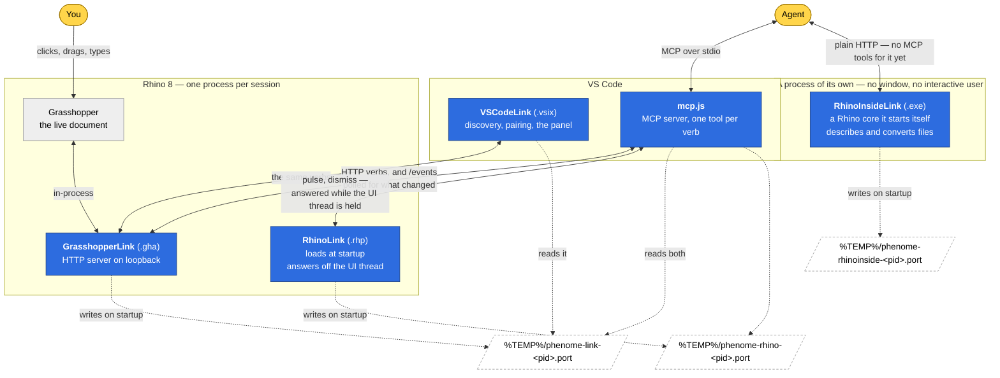
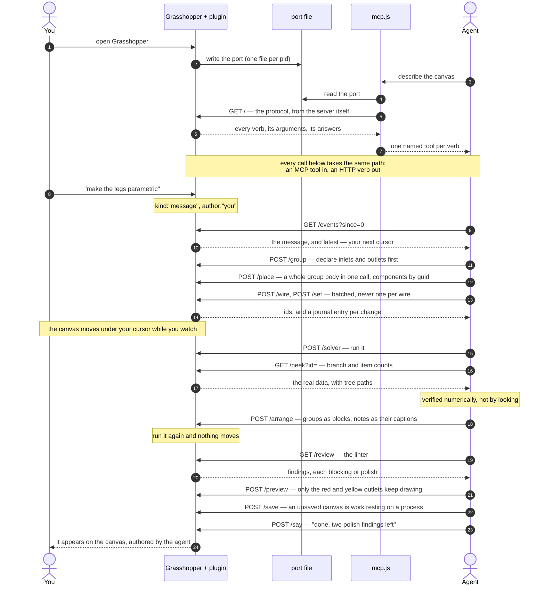
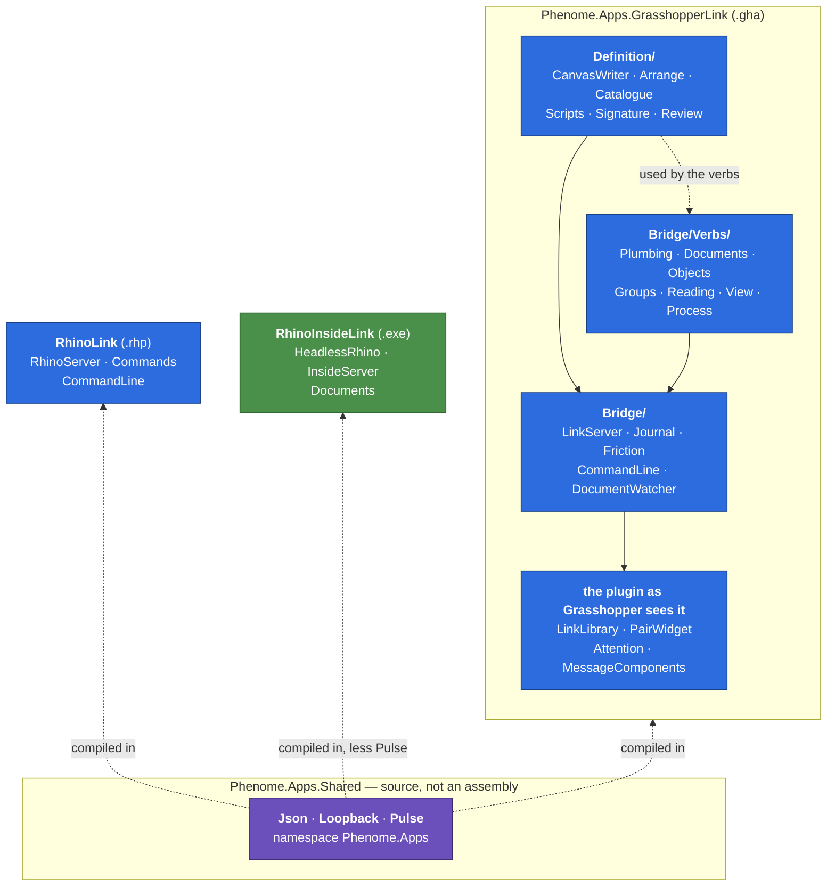

# Phenome Link

Phenome Link lets an AI agent read and edit a live Grasshopper definition in Rhino 8 on Windows (macOS is
untested). The agent works through 54 MCP tools: it places and wires components, sets values, groups and lays
out the canvas, measures geometry, and runs a review against composition rules. Each change appears on the
open canvas, and the journal records who made it.

The link is a Grasshopper plugin, a Rhino plugin and a VS Code extension, released together under one
version number.

| | |
|---|---|
| [`src/Phenome.Apps.GrasshopperLink`](src/Phenome.Apps.GrasshopperLink) | The canvas end: a Grasshopper plugin that exposes the live document, and verbs to edit it. |
| [`src/Phenome.Apps.RhinoLink`](src/Phenome.Apps.RhinoLink) | The Rhino end: a plugin that loads with Rhino itself, reports whether the UI thread is free and which dialog is holding it, answers dialogs, runs command scripts, and loads plug-ins. |
| [`src/Phenome.Apps.VSCodeLink`](src/Phenome.Apps.VSCodeLink) | The editor end: a VS Code extension with an MCP server that offers the protocol to an agent as named tools. |
| [`src/Phenome.Apps.ClaudeDesktopLink`](src/Phenome.Apps.ClaudeDesktopLink) | The same MCP server packed as a Claude Desktop extension, with both plugins inside it; it installs them into Rhino's package folder. |

Both plugins listen on 127.0.0.1 only, and the link needs no account, no service and no other Phenome
library. The protocol is plain HTTP and JSON, and any agent or script that can send a request can use it
under the MIT licence.

> ### Breaking change in 0.30.0: re-pair every workspace
>
> The MCP tools are now **`mcp__phenome__*`**, not `mcp__grasshopper__*`. The prefix comes from the
> registration key the pairing writes and changes nowhere else. A workspace paired before this version finds
> **no tools at all**, with no error message, until **Pair with VS Code** (or *Teach Agents in This
> Workspace*) runs in it again.
>
> Re-pairing is idempotent: it rewrites the registration in all five host files and the permission rule, and
> removes the old name. Do both together. A host that finds both the old and the new key registers two
> servers and offers every verb twice.
>
> The Rhino half answers commands, the document, the command line, the dialogs, the plug-ins and the
> viewport, also in a Rhino that never opened a canvas, and the new prefix reflects that. The old
> *grasshopper* prefix misled agents into starting Grasshopper just to install a Rhino `.rhp`.
>
> Nothing else breaks: `dismiss`, superseded by `dialog` in 0.31.0, still works.

## What the link is for

In Grasshopper, one person has the canvas and everyone else has a description of it. The link exposes the
document, its wires, its data and its solver state over HTTP, and the same verbs read and edit it. The window
and the agent are peers: both are clients, and neither owns the session.

- **Look.** An agent reads the document as JSON or as a mermaid flowchart, one object's real parameters,
  every wire, a parameter's full data with tree paths, the installed component catalogue, the linter's
  findings, the canvas as a picture, the Rhino viewport, where the camera stands and which plugins are
  loaded. A note comes back with its text as it reads, its bounding box and the group it labels. An agent
  checks this way that its own note landed, without asking someone to read the screen.
- **Build.** An agent places a whole group body in one call, wires and sets values in batches, groups,
  plants a group's signature as floating parameters, lays the graph out, deletes (refused when that would
  cut live wires), selects, zooms, undoes and redoes. The layout moves the notes as well: a note in a group
  becomes that group's caption, a note in none becomes the document's title, and running the layout twice
  changes nothing.
- **Run and keep.** An agent controls the solver, bakes, sets data mapping, creates, opens and saves
  documents, and writes a C# component's source and gets its compile errors back. Every open document can be
  listed and switched to. Closing has two verbs and no flag: one discards what is unsaved, the other writes it
  first. `new` and `open` leave the previous document open, which makes open documents pile up over a long
  session. The preview can be quieted when construction geometry hides the result: for the whole document on
  the colour rule, for one group, or for one component whose intermediate output floods the viewport. An
  agent's edit marks the document modified like any other edit, and closing Rhino afterwards offers to save
  instead of discarding the work silently.
- **Say.** Messages go both ways. A friction log records the requests a verb refused and anything an agent
  chose to report.
- **Get unstuck.** The link reports whether Rhino is idle, busy or blocked, which dialog is holding it and how
  to answer it, and the tail of Rhino's own command line, where commands and scripts reply.
- **Develop a plug-in.** `plugins` lists every plug-in Rhino has a record of, loaded or not, with the path
  Rhino has recorded, the registry key, whether it is load protected and which of Rhino's two runtimes is
  hosting. `rhino_load` loads one without its confirmation dialog, and loads it again after a failed attempt.
  `restart` restarts the process, the only way a rebuilt assembly reaches a running Rhino. None of this needs
  a canvas, and `launch` with `grasshopper: false` is enough. The viewport and the camera answer in that
  Rhino too, because the Rhino half serves them.

## When the canvas is not the problem

Every verb above runs on Rhino's UI thread, and all of them fail the same way while that thread is blocked.
Two cases need opposite handling: a running command is worth waiting for, and a modal dialog will wait
forever. An agent that cannot tell them apart either abandons work that was about to finish or waits on a
process that can never move.

A second, smaller server reports on the process from its own thread:

- **`pulse`** answers `idle`, `busy` or `blocked`. Busy names the running command and how long it has run.
  Blocked names the dialog and lists its buttons, or reports that none can be clicked. The latter happens
  with Rhino's newer dialogs, which draw their own buttons and offer nothing to post a click to.
- **`dialog`** presses a button by name, types a key into a dialog that draws its own buttons, or declines
  with `close`. Send one of the three; with no answer given it refuses and lists what the dialog offers, and
  it does not decide on the caller's behalf. Nothing guesses which button is affirmative: on a save prompt it
  is whichever of Save and Don't Save the caller meant. (`dismiss` is the old name and still works, with the
  old default: nothing given means close, and close means decline.)
- **`escape`** covers the case `dialog` cannot answer. A command waiting on a pick is not a dialog: nothing
  is disabled and there is no window to click, yet the thread is held. An interactive command run from a
  script ends up in this state.
- **`console`** returns the tail of the command line, which is where Rhino answers. The link writes a line
  into it on every request, for a user watching an agent's actions, and before `console` it read nothing
  back.

This half lives in the Rhino plugin and not in the Grasshopper one. A `.gha` does not exist until
Grasshopper has started, and nothing in it can report on a dialog that appears while Rhino is still
starting, which is also when nothing else can answer.

## A headless Rhino

The third component is a program, not a plugin. It starts a Rhino core in its own process with no window
and works on files on disk, since there is no open document. It is useful on an unattended machine, to
describe a `.3dm` or convert one to `.stl`, `.obj`, `.dxf` or `.step`. It is not part of the installed pair
and is built from source; no release ships it.

Rhino commands do not run there, and this was measured: `RunScript` returns false in a windowless core and
changes nothing, whether the document was opened headless or normally. Its verbs only describe and convert,
and anything that is a command belongs in a real Rhino, through the plugin above.

```powershell
dotnet run --project src/Phenome.Apps.RhinoInsideLink
```

It prints the port it bound and writes it to `%TEMP%\phenome-rhinoinside-<pid>.port`. `GET /` describes the
protocol and `POST /quit` ends it.

## The agent's work is visible

While an agent is working, every Rhino viewport and the Grasshopper canvas show a two-pixel Object Orange
border. It clears a few seconds after the agent's last action, and an idle screen never shows it. A paired
client's heartbeat does not count as an action. If it did, the border would only mean "a client is connected",
which stops being informative after the first hour.

The border is drawn instead of announced, because a dialog must be dismissed and a command-history line scrolls away, while a
border is seen without being read.

Every action is appended to the journal with an author on each entry. A client polls the journal for what
changed and skips its own echo. `GET /` describes the whole protocol; it is generated from the server and is
authoritative over this file.

## How it fits together

The link has six parts. Everything crosses process boundaries as HTTP on loopback or MCP over stdio. There is
no shared memory and no database, and nothing is sent off the machine.


```mermaid
flowchart TD
    user([You]):::person
    agent([Agent]):::person

    subgraph rhino["Rhino 8 — one process per session"]
        rhp["<b>RhinoLink</b> (.rhp)<br/>loads at startup<br/>answers off the UI thread"]:::ours
        gh["Grasshopper<br/>the live document"]:::host
        plugin["<b>GrasshopperLink</b> (.gha)<br/>HTTP server on loopback"]:::ours
    end

    subgraph code["VS Code"]
        ext["<b>VSCodeLink</b> (.vsix)<br/>discovery, pairing, the panel"]:::ours
        mcp["<b>mcp.js</b><br/>MCP server, one tool per verb"]:::ours
    end

    subgraph inside["A process of its own — no window, no interactive user"]
        rin["<b>RhinoInsideLink</b> (.exe)<br/>a Rhino core it starts itself<br/>describes and converts files"]:::ours
    end

    port[/"%TEMP%/phenome-link-&lt;pid&gt;.port"/]:::file
    rport[/"%TEMP%/phenome-rhino-&lt;pid&gt;.port"/]:::file
    iport[/"%TEMP%/phenome-rhinoinside-&lt;pid&gt;.port"/]:::file

    user -->|clicks, drags, types| gh
    gh <-->|in-process| plugin
    agent <-->|MCP over stdio| mcp

    mcp <-->|"HTTP verbs, and /events<br/>polled for what changed"| plugin
    ext <-->|the same verbs| plugin
    mcp <-->|"pulse, dismiss —<br/>answered while the UI thread is held"| rhp
    agent <-->|"plain HTTP — no MCP tools for it yet"| rin

    plugin -.->|writes on startup| port
    rhp -.->|writes on startup| rport
    rin -.->|writes on startup| iport
    ext -.->|reads it| port
    mcp -.->|reads both| port
    mcp -.-> rport

    classDef ours fill:#2d6cdf,stroke:#1b3f85,color:#fff
    classDef host fill:#eee,stroke:#999,color:#000
    classDef person fill:#ffd54a,stroke:#a07800,color:#000
    classDef file fill:#fff,stroke:#999,color:#000,stroke-dasharray: 4 3
```

The sixth part, RhinoInsideLink, is the newest and the exception. It is not installed and not part of the
pair. The MCP layer has no tools for it, and an agent reaches it over plain HTTP, as it would anything else
here.

Four properties follow from this shape, and they are the reasons it is built this way:

**The canvas is the only source of truth.** The plugin holds no model of the document; every read walks the
live Grasshopper objects. An agent and a user cannot drift apart, because no second copy of the document
exists for either to fall out of step with.

**Clients are peers, and none owns the session.** The window and the agent use the same verbs over the same
protocol. Neither can do something the other cannot see, because everything either does is recorded in the
journal with an author.

**A port file is the whole of discovery.** There is no registry, no daemon and no fixed port. Several Rhinos
can run at once, and each agent can be pinned to one. A stale file has a dead pid, and no file means no
session. Each Rhino writes two files (one per server) under the same pid, and the two halves of a Rhino find
each other by that pid without either knowing the other exists. A headless core uses a third name, since it
is its own process and shares no pid. The three names differ, and a file's name says which server wrote it.

**The Rhino end answers when the canvas end cannot.** It runs on its own thread and touches nothing that needs
the UI. Every verb it offers must work while the UI thread is held, because a held thread is the reason the
Rhino end exists.

## A session, end to end

The diagram follows what travels between the parts in one session, starting cold and ending with a checked
result:


```mermaid
sequenceDiagram
    autonumber
    actor H as You
    participant GH as Grasshopper + plugin
    participant P as port file
    participant M as mcp.js
    actor A as Agent

    H->>GH: open Grasshopper
    GH->>P: write the port (one file per pid)

    A->>M: describe the canvas
    M->>P: read the port
    M->>GH: GET / — the protocol, from the server itself
    GH-->>M: every verb, its arguments, its answers
    M-->>A: one named tool per verb

    Note over A,GH: every call below takes the same path:<br/>an MCP tool in, an HTTP verb out

    H->>GH: "make the legs parametric"
    Note over GH: kind:"message", author:"you"

    A->>GH: GET /events?since=0
    GH-->>A: the message, and latest — your next cursor

    A->>GH: POST /group — declare inlets and outlets first
    A->>GH: POST /place — a whole group body in one call, components by guid
    A->>GH: POST /wire, POST /set — batched, never one per wire
    GH-->>A: ids, and a journal entry per change

    Note over H,GH: the canvas moves under your cursor while you watch

    A->>GH: POST /solver — run it
    A->>GH: GET /peek?id= — branch and item counts
    GH-->>A: the real data, with tree paths
    Note over A: verified numerically, not by looking

    A->>GH: POST /arrange — groups as blocks, notes as their captions
    Note over GH: run it again and nothing moves

    A->>GH: GET /review — the linter
    GH-->>A: findings, each blocking or polish

    A->>GH: POST /preview — only the red and yellow outlets keep drawing
    A->>GH: POST /save — an unsaved canvas is work resting on a process
    A->>GH: POST /say — "done, two polish findings left"
    GH-->>H: it appears on the canvas, authored by the agent
```

A client uses the author on each journal entry to skip its own echo and see only what other clients did.
`GET /events?since=N` answers with a `latest` to use as the next cursor. A gap below the cursor means entries
were dropped; re-read `/canvas` then instead of guessing.

## How the code is laid out

This section is for those reading the source. The dependencies run one way, and that is the whole of the
arrangement:


```mermaid
flowchart BT
    subgraph shared["Phenome.Apps.Shared — source, not an assembly"]
        sh["<b>Json</b> · <b>Loopback</b> · <b>Pulse</b><br/>namespace Phenome.Apps"]:::sh
    end

    subgraph gha["Phenome.Apps.GrasshopperLink (.gha)"]
        def["<b>Definition/</b><br/>CanvasWriter · Arrange · Catalogue<br/>Scripts · Signature · Review"]:::a
        bridge["<b>Bridge/</b><br/>LinkServer · Journal · Friction<br/>CommandLine · DocumentWatcher"]:::a
        verbs["<b>Bridge/Verbs/</b><br/>Plumbing · Documents · Objects<br/>Groups · Reading · View · Process"]:::a
        surface["<b>the plugin as Grasshopper sees it</b><br/>LinkLibrary · PairWidget<br/>Attention · MessageComponents"]:::a
    end

    rhp["<b>RhinoLink</b> (.rhp)<br/>RhinoServer · Commands<br/>CommandLine"]:::b
    rin["<b>RhinoInsideLink</b> (.exe)<br/>HeadlessRhino · InsideServer<br/>Documents"]:::c

    def --> bridge
    verbs --> bridge
    bridge --> surface
    def -.->|"used by the verbs"| verbs

    sh -.->|compiled in| gha
    sh -.->|compiled in| rhp
    sh -.->|"compiled in, less Pulse"| rin

    classDef sh fill:#6b4fbb,stroke:#3d2a70,color:#fff
    classDef a fill:#2d6cdf,stroke:#1b3f85,color:#fff
    classDef b fill:#2d6cdf,stroke:#1b3f85,color:#fff
    classDef c fill:#4a8f4a,stroke:#2a5c2a,color:#fff
```

**`Definition/` holds no HTTP code.** It reads, lays out and reviews a Grasshopper document, and its only
call into `Bridge/` is `Plumbing.Solve`, which re-enables a disabled document before a solution. **`Bridge/`** is the server: routing, the journal, the friction log and the command-line capture.
**`Bridge/Verbs/`** holds one class per family of verbs. `Plumbing` holds what every verb needs: reading a
request, getting onto the UI thread and protecting the document before an edit. The server routes requests
and the verb classes carry them out.

Namespace nesting handles the rest. Code in `Bridge` or `Bridge/Verbs` sees the plugin surface's types
because their namespace is the parent of its own. The shared source sits in `Phenome.Apps`, the parent of all
of them, which leaves no call site needing a qualifier.

**`Pulse` is compiled into two of the three projects.** It tells whether Rhino is idle, busy or blocked from
the main window and the idle events. A windowless core has neither, and the headless project omits `Pulse`
instead of including code that would always report "no dialog". A dialog can still occur there; `Pulse` is
just not how one is detected in a windowless process.

## Installing

The link needs **Rhino 8** on Windows (a Mac is untested, see below), **VS Code**, **Node.js** and an **agent
that speaks MCP**, such as Claude Code or any other.

No account is needed anywhere, and nothing leaves the machine: the server listens on loopback only.

Install both halves; they are built to work as a pair.

### macOS (untested)

The `.yak` that `tools/pack-yak.ps1` builds is tagged for any platform, and Rhino for Mac would install it
from a package folder. Nobody has run it on a Mac. The code has been prepared for macOS and not tried there:

- `launch` and `restart` start `/Applications/Rhino 8.app/Contents/MacOS/Rhinoceros` with
  `-runscript=_Grasshopper`, the spelling from McNeel's forum for Rhino for Mac. `PHENOME_RHINO` points them
  at a Rhino installed elsewhere, on either system.
- Port files go to `$TMPDIR`, where both the plugin and the MCP server look for them on macOS. The friction
  log goes to .NET's local application data folder (`~/Library/Application Support/Phenome/` on .NET 8), and
  `GET /friction` reports the exact path.
- Dialogs cannot be read, because finding and answering them is Win32 code. On macOS `pulse` still tells idle
  from busy, reports an open dialog as busy, and adds `dialogsReadable: false`. `dialog`, `dismiss` and
  `escape` return an error asking for the user.
- `screenshot` and `canvas_image` draw through `System.Drawing`, which Rhino for Mac implements differently,
  and they are the two likeliest to misbehave.

**A report from a Mac with Rhino 8 is welcome and takes about an hour.** Install the package, start Rhino with
Grasshopper, and call `pulse`, `canvas`, `place`, `measure`, `screenshot` and `canvas_image`. Send what each
one returned or refused to [hi+phenomelogs@object.pl](mailto:hi+phenomelogs@object.pl) or file an issue. A
refusal is as useful as a success.

### Claude Desktop

The release carries `phenome-link-<version>.mcpb`, an extension for Claude Desktop on Windows. Opening it in
Claude Desktop installs the MCP server, and the server copies the `.gha` and the `.rhp` into Rhino's package
folder when it first starts. Rhino loads them at its next start, so a Rhino that was open during the install
has to be restarted once. VS Code and Node.js are not needed for this route. A `.gha` already copied into
`%APPDATA%\Grasshopper\Libraries` by hand stops the install, and `sessions` then says which file to remove.
[docs/distribution.md](docs/distribution.md) describes the rest.

### From the release (recommended)

Download the newest [release](https://github.com/theObjectCo/Phenome/releases). [CHANGELOG.md](CHANGELOG.md)
lists what changed since each earlier version; read it before upgrading in the middle of a session.

Place the three files:

1. Copy `Phenome.Apps.GrasshopperLink.gha` into `%APPDATA%\Grasshopper\Libraries\`, then right-click it,
   Properties, and **Unblock**. Windows marks files downloaded from elsewhere, and Grasshopper silently
   refuses a blocked assembly. This is the most-missed step; the symptom is that no Phenome components appear.
2. Drag `Phenome.Apps.RhinoLink.rhp` onto an open Rhino, or point `PlugInManager` at it. Rhino updates its list
   of loaded plug-ins when it closes normally. A killed Rhino drops the registrations made in that session,
   and plug-ins recorded at an earlier normal close still load.
3. `code --install-extension phenome-link-<version>.vsix`

### A package instead of the release files

No Yak package is published, and none is planned. The link is distributed as a repository and a release, and
a package server would be a second thing to keep in step. A `.yak` is just a folder with a manifest, and one
command builds it for a single user or a whole studio:

```powershell
pwsh tools/pack-yak.ps1 -From dist -Destination <a folder you can read>
```

Add that folder as a package source in Rhino (**Tools > Options > Packages**, or `PackageManagerSettings`)
and install from it. Everyone who can read the folder can install, and nobody else can. That is the entire
access model, and it suits a studio better than the public. The package includes the `.vsix`, and the
canvas's **Pair with VS Code** button can install the editor half from it on first pairing.

**A release never includes a `.yak`.** Some earlier releases did. Packaging needs `Yak.exe`, which ships
inside Rhino and is not on any hosted runner; the packaging job required a self-hosted Windows machine and
produced an attachment present on some releases and absent on others. An unreliable attachment is worse than
an honestly missing one, because it makes the install steps conditional on something the reader cannot
verify. A release is the three files, and the packaging script above is run by whoever wants a package. No CI
covers the script, and a green check says nothing about whether it still packs.

### From source

Building needs the .NET SDK, Rhino 8 and Node.js:

```powershell
pwsh tools/build.ps1
```

That leaves both halves in `dist/`; install them as above.

### Then, either way

Restart Rhino and open Grasshopper. The plugin picks an ephemeral port and writes it to
`%TEMP%\phenome-link-<pid>.port`. Each Rhino writes its own file, several sessions can run at once, and each
agent can have a canvas of its own.

**Check that it is alive** with a Grasshopper window open:

```powershell
Get-Content (Get-ChildItem $env:TEMP -Filter 'phenome-link-*.port')[0].FullName
curl http://127.0.0.1:<that port>/
```

A description of the whole protocol comes back. No port file means the plugin did not load, and on a fresh
install the cause is almost always step 1 above.

### Accessing a remote machine

The Rhino machine can be used from elsewhere. Turn on VS Code's remote tunnel on it and open it from a browser
anywhere. The extension, the MCP server and the agent all run beside Rhino, and the link never leaves
loopback. Remote access needs no extra installation or configuration on the link's side.

The recipe and its five limitations are in [docs/from-anywhere.md](docs/from-anywhere.md). The most important
caveat is that the machine must be awake and logged in, because a canvas needs a desktop.

## Talking to it

Any HTTP client is a peer:

```
curl http://127.0.0.1:<port>/            # the protocol, in full
curl http://127.0.0.1:<port>/canvas      # the document
```

For an agent, the MCP server is the better entry point: it wraps all 54 verbs as named tools. Point the MCP
client at `mcp.js` in the extension, or let the extension launch the agent, which pins the session to one
canvas through an environment variable.

### Approve the server once, not 54 times

Run **Phenome Link: Teach Agents in This Workspace** from the VS Code command palette, once per project. It
writes the pairing notes into `AGENTS.md`, registers the MCP server in `.mcp.json`, and adds a single rule to
`.claude/settings.local.json`:

```json
{
  "enableAllProjectMcpServers": true,
  "permissions": { "allow": ["mcp__phenome"] }
}
```

A taught workspace stays current without running the command again. At startup the extension compares the
workspace's `.phenome/gh-mcp.js` and the notes section in `AGENTS.md` with the ones it carries, and when either
differs it writes them again and shows one message. A workspace that was never taught is not touched, and the
setting `phenomeLink.updateTaughtWorkspaces` turns the update off.

**One rule names the whole server** and trusts every verb at once, including verbs added in a later version.
Restart the agent session afterwards: MCP servers load at session start.

Without it, a client that asks per tool prompts once for each verb the first time it is used (roughly 54
prompts) and accumulates per-verb rules, and every new verb prompts again. If that has already happened, the
single `mcp__phenome` rule takes precedence; the leftover per-verb entries are harmless and can be deleted.
Other agents store permissions elsewhere, and there too one rule should trust the whole server.

**For anyone writing their own client**, [docs/protocol.md](docs/protocol.md) covers what the generated description
cannot: how sessions are discovered, how the journal's cursor and its gaps behave, and the handful of rules
every verb shares.

## When a verb refuses

The plugin keeps a **friction log** in the file below. It records every refused request, with what was asked
and what the plugin answered, and anything an agent chose to report.

```
%LOCALAPPDATA%\Phenome\link-friction.jsonl
```

The log is written locally and **nothing is ever sent from the plugin**. `GET /friction` reads it back.
`POST /feedback` assembles the session, the linter's findings and the recent friction into one file and returns
a `mailto` link with everything filled in. The user sends it from their own mail client, after reading it.

**Send the file to [hi+phenomelogs@object.pl](mailto:hi+phenomelogs@object.pl) to have the maintainers look at
it.** A verb that refused a reasonable request is a design fault in the link, and the log records exactly which
request, against which version, and in what order.

Read the file before sending it. It records the requests made against the canvas and can name components and
files from the definition being worked on. It contains no geometry, and nothing about the machine beyond the
plugin's version.

## Licence

The link is released under the MIT licence; see [LICENSE](LICENSE).
