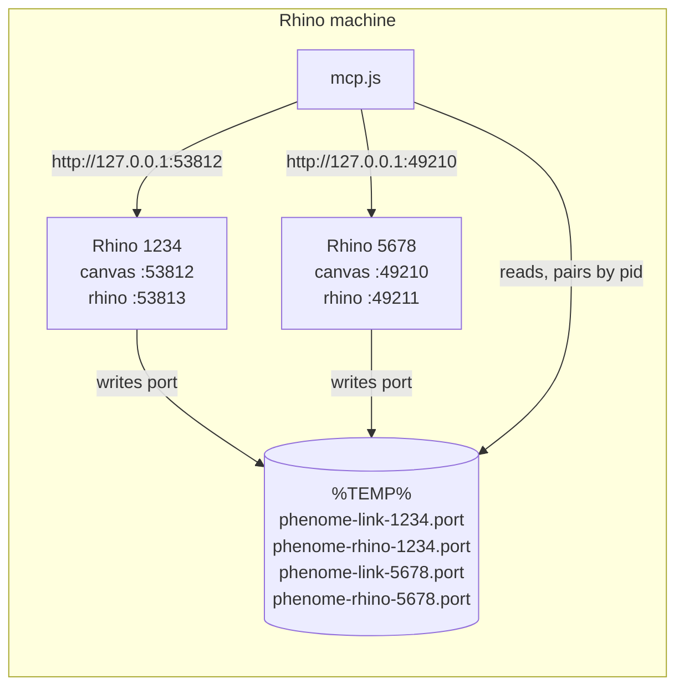
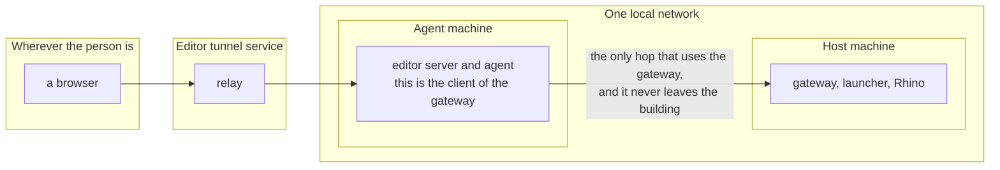
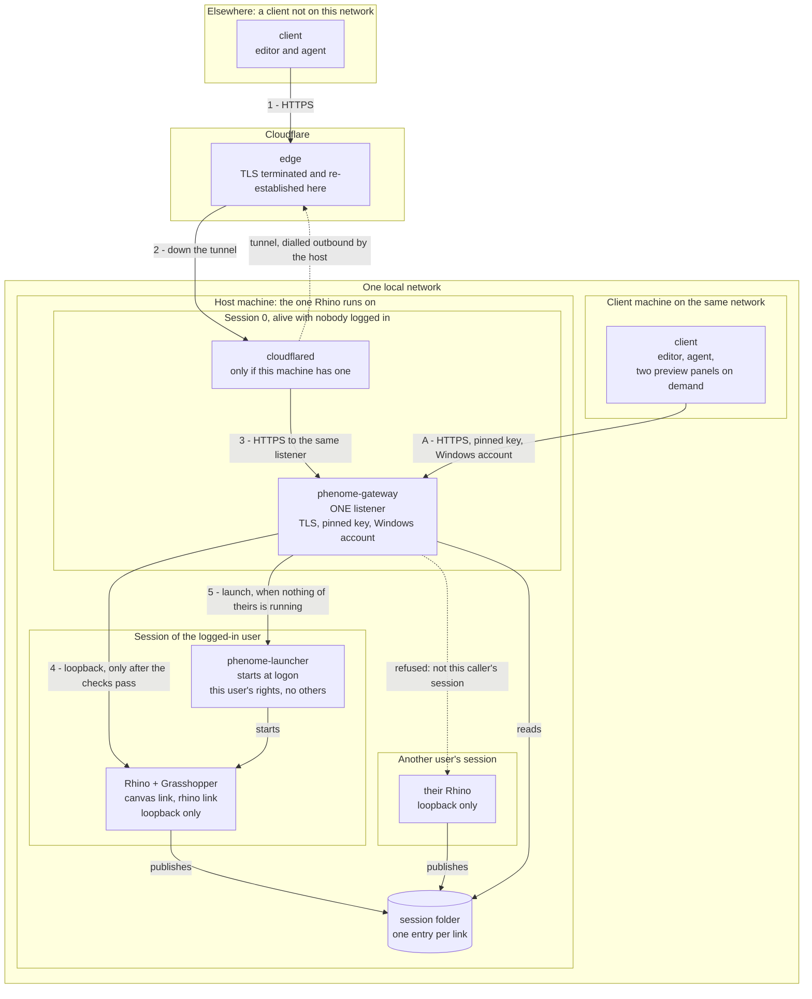
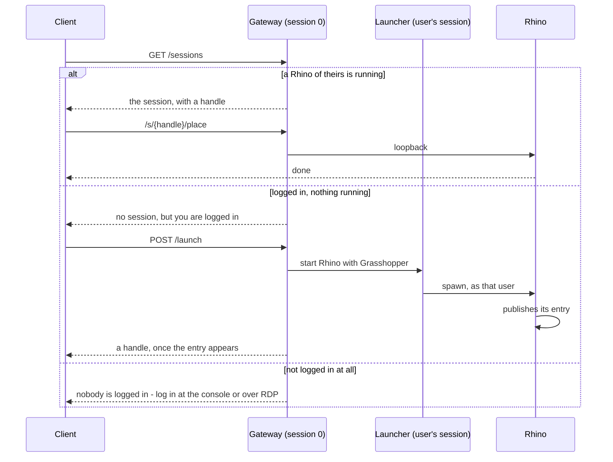
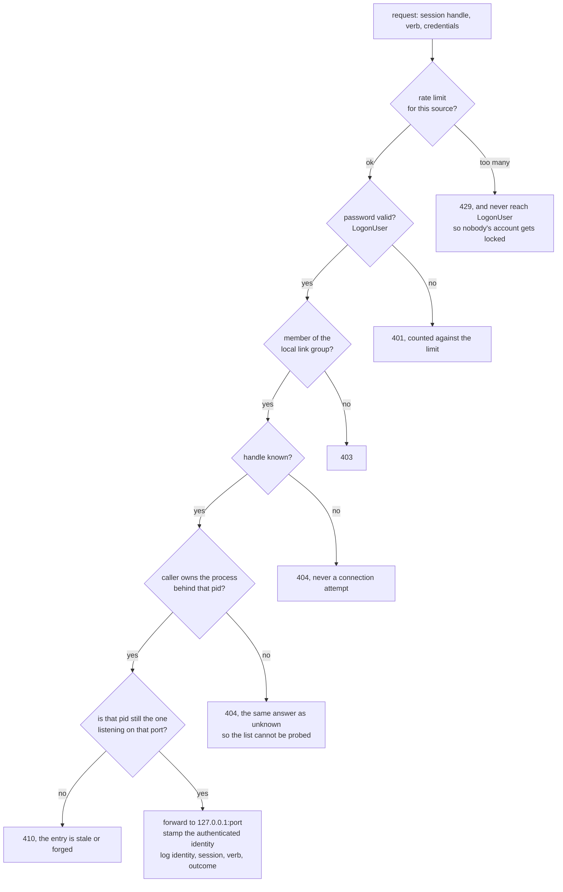

# Driving a canvas on another machine

A design note, not a description of what ships. As of 0.31.0 the link is loopback only. This is the plan
for reaching a Rhino from a different machine, and the record of what was considered and turned down.

**Nothing here changes the plugins that ship today.** A Rhino without the gateway installed behaves exactly
as it does now, and so does a client without the new configuration. The gateway is a separate download.

## What exists today

Three servers, each on its own ephemeral loopback port, each publishing that port in a file whose **name
carries the process id**. The client globs the files, probes each port, and pairs a canvas with the Rhino of
the same pid.



Two properties worth naming, because every option below was judged on whether it keeps them. **There is no
coordinator**: sessions do not know about each other, and a Rhino that starts or dies changes nothing for
the others. **Authentication is the loopback interface**: nothing checks who is calling, because nobody
outside the machine can.

## The other discovery path, which is a push

The diagram above is only half the story, and the other half is the one that matters for a remote setup.

Clicking the pair widget runs `Process.Start` on `vscode://phenome.phenome-link/pair?port=NNNN`, with the
template held in the Grasshopper setting `PhenomeLink:PairUri`. Windows resolves the protocol handler, VS
Code wakes, and `handleUri` pins the port, resets the journal cursor and opens a terminal with
**`PHENOME_GH_PORT` in its environment**, handshake prompt already typed. That variable binds the agent's
MCP server to the canvas whose button was pressed rather than to whichever session answers first.

**This path cannot cross machines, by construction.** `Process.Start` on a `vscode://` URI opens the editor
on the machine that ran it, and so does `EnsureExtension`, which hands the bundled `.vsix` to the local VS
Code. A canvas on one box cannot summon an editor on another by launching a URI.

So remote pairing is started from the client side: the human connects from their own editor, asks what is
running on that host, and picks. Which is also the feature the editor is missing today, see *A session
picker* below.

## The constraints that shape everything

**A URL reservation names one port.** On Windows, `HttpListener` binding a prefix other than loopback needs
either an elevated process or `netsh http add urlacl`. Rhino does not run elevated and should not, and
ephemeral ports cannot be reserved in advance because their numbers are not known until something binds
them. So whatever listens on the network has to be something else, on a fixed port, installed deliberately.

**A service runs in session 0.** Its `%TEMP%` is `C:\Windows\Temp`, not the temp directory of the user
running Rhino. A machine-wide place to publish sessions is therefore part of the design, not a nicety.

**The plugin is published, and other people's networks are not ours.** No Cloudflare, no Entra, no
assumption that the local network is trustworthy, and no appetite for a heavy install. Anything that
depends on our topology is a configuration, not a feature.

**Local work must survive a dead internet connection.** A canvas on one machine and an agent on the next
one must keep working when the line to the outside is down. This is what rules out an external identity
provider as the only way in.

## The design

A gateway process, separate from Rhino, running whether or not anybody is logged in, owning fixed ports and
forwarding to the loopback servers, which do not change at all.

Drawn by machine, because which box a thing runs on is what decides its identity, its transport and what
happens to it when the line goes down.

The arrangement this was designed for is drawn first, because it is the one that carries the weight and it
is simpler than the general case: **a person far away does not talk to the gateway at all.**



The person's connection ends at the agent machine. From there the client is a process on the same network as
Rhino, so the gateway is reached locally, with no internet in the path. Everything the design asks of the
local route - that it keep working when the line is down, that it authenticate against the machine itself -
is exactly what this picture needs.

The general case below adds one more way of arriving, for a client that is **not** on this network: a
laptop somewhere else running its own editor, driving the host directly.

This is secondary, and it turns out to cost nothing. Because there is one listener rather than two, that
case is `cloudflared` pointed at the address the local clients already use: a line in somebody's tunnel
configuration, not a feature in the gateway. There is no second path to write, no second policy to keep
correct, and nothing to defer to a later version.



Four things the arrows are saying that are easy to miss. **There is one listener and one policy**: the
tunnel is a way of arriving, not a reason to be trusted, so a request off the tunnel proves who it is
exactly as a request from the next room does. **The tunnel is dialled outbound by the host**, so nothing
is exposed and no port is forwarded. **The Rhino links never leave the host** - they bind loopback, exactly
as they do today, and the only thing that talks to them is a process on the same machine. And **arrow 5
never starts anything itself**: the gateway asks a helper that is already running as the user, so no
network-facing service ever holds the right to create processes as somebody else.

The dotted refusal is the authorisation rule, not an error: a caller reaches the sessions they own and no
others.

### What the answer is, in each of the three states



The third branch is the one worth having. No service can create an interactive session, so the honest
answer is a sentence telling the caller what to do, not an empty list that leaves a human or an agent to
work it out and guess wrong.

### What crosses each boundary

| boundary | what travels | identity checked | with the internet down |
|---|---|---|---|
| elsewhere to Cloudflare | HTTPS | none yet, the edge only carries | dead, and that is fine |
| Cloudflare to host | the existing tunnel | none, the tunnel is the credential | dead |
| cloudflared to gateway | HTTPS on loopback, key pinned | **Windows account, `LogonUser`** | dead |
| network client to gateway | HTTPS, key pinned | **Windows account, `LogonUser`** | **works** |
| gateway to a Rhino link | loopback HTTP | none, same as today | works |
| Rhino to the session folder | a file | filesystem ACL, create-file and read-own | works |

Rows three and four check the same thing, and that is the point of collapsing the two listeners into one.
Row four is what the whole arrangement exists for: two machines on one switch, answering to nothing outside
the building.

### What the gateway checks, in order



Two of those steps exist because of things the gateway must not believe. The **pid check** is there because
the `user` field in a session entry is written by the plugin running as that user, so it is a claim; the
owner of the process is not. The **port check** is there because the port number in the entry is a claim
too, and without it a local attacker publishes an entry pointing at a port they control.

Note the ordering: the rate limit comes **before** `LogonUser`, so failed attempts cannot be used to lock
somebody out of their own machine. And an unauthorised session answers exactly as an unknown one does, so
the inventory cannot be probed from outside.

### One listener, one policy

An earlier draft had two: a network listener with a Windows account, and a loopback one for the tunnel that
would accept a signed assertion from the edge instead, so that working from far away cost one login rather
than two.

It was dropped, and the reason is worth keeping. A loopback listener cannot tell cloudflared from any other
process on the machine, because **loopback carries no identity**. Trusting it means trusting every local
process. And the verifier would have been optional, which means default, which means somebody points a
tunnel at an unconfigured gateway and publishes remote code execution to the internet with nothing visibly
broken.

So there is one listener, and arriving down a tunnel is a way of arriving rather than a reason to be
believed. `cloudflared` forwards to it like any other client, over TLS, and whoever is at the far end logs
in with a Windows account.

| | |
|---|---|
| who reaches it | anything that can route to the machine, tunnel included |
| identity | a Windows account, `LogonUser`, plus membership of a local group |
| TLS | required, self-signed, the client pins the key |
| URL reservation | one, at install |
| with the internet down | works, because the account is resolved on the machine itself |

What this costs is the single sign-on that the edge could have provided: from far away there is the tunnel's
own gate, if the owner configured one, and then the gateway's. That is a real cost and it buys one policy to
reason about instead of two, and no path that can be left open by omission.

### Two endpoints

```
GET  /sessions             -> the caller's own sessions in full, plus a count of everyone else's
ANY  /s/{handle}{verb}     -> forwarded to the session behind that handle
```

**The handle is issued by the gateway**, is unguessable, and maps to a port inside the gateway. A port
number never travels on the wire, so there is nothing for a caller to substitute: asking for a port the
gateway did not offer is not a refused connection, it is a request that cannot be expressed.

`/sessions` shows other people's work as a number and nothing else. Enough to know the machine is busy,
not enough to learn who is on it or what they have open.

### Logging in, once, and then never again

A password cannot be the thing that carries a session. An agent runs for hours with nobody at the keyboard,
`mcp.js` is a server on a pipe with no way to prompt, and any credential with an expiry eventually stops
work in the middle of it. That is the same failure that ruled out an external identity provider, and it
would have come back wearing our own token.

**SSH settled this long ago, so the arrangement is its one.** The client generates a key pair on first run.
Registering a machine is one command in which a person gives an account and a password, over TLS, once:
the gateway checks `LogonUser`, checks the group, and stores the **public** key against that Windows
account. From then on the gateway offers a challenge, the client signs it, and a short-lived token carries
the working session. `known_hosts` in one direction, `authorized_keys` in the other, and nobody has to learn
a new idea.

What that buys over a bearer credential is the part worth keeping in mind: **the gateway holds nothing that
can be used to impersonate anybody.** A leak of its store is a leak of public keys. Revocation is per
machine, one entry removed, with no password changed and nobody else disturbed. And the password crosses the
wire exactly once in the life of a client rather than once per session.

**The signature is not the whole check.** An account can be disabled or dropped from the group after it was
registered, so membership and the account's standing are re-checked every time a token is issued, not only
at registration. Otherwise this quietly becomes a second register of permissions alongside Windows, drifting
from it, which is the thing choosing Windows accounts was meant to avoid.

A private key sitting unencrypted on the client is a credential at rest, guarded by file permissions and
nothing else. That is true of SSH too, and for an unattended agent it is the point rather than an oversight,
but it should be said rather than discovered.

The gateway never logs the credential header, never puts a request into an exception message, and clears
the buffer after the check. Worth saying in the code at the place it matters, because this is the kind of
thing a later change made in a hurry puts back.

**The rate limit sits in front of `LogonUser`, not behind it.** Failed attempts count against Windows
account lockout, so without that ordering anyone who can reach the machine locks a person out of their own
account, at the console as well. For the same reason the documentation recommends a purpose-made local
account for this rather than the one somebody logs in with every morning.

Membership of a local group created at install is a condition alongside the password. An account existing
is not evidence that its owner was ever meant to drive Rhino, and a machine that has been in use for years
has accounts nobody remembers creating.

### Limits

One cap on requests in flight across the whole gateway, with the excess refused rather than queued. It
protects the service's own threads and sockets, which is the only part of this a caller can exhaust: a
flood can otherwise only reach the flooder's own sessions, so it freezes their Rhino and nobody else's.

Queueing is deliberately not the answer. The protocol says no answer at all tells you nothing about whether
the work ran, so a queue that silently lengthens the wait is worse than a refusal a client can act on.

TLS on that listener is not negotiable and not a matter of how safe a particular network is. The credential
is **a Windows account password**, and the plugin ships to people whose networks we know nothing about.

### The certificate, and how it stays a one-time thing

The gateway makes its own certificate at install and the client pins it. Left naive, "one-time" quietly
becomes "every year, on every client", so three decisions make it true.

**Pin the public key, not the certificate.** A certificate expires; a key need not. Renewing on the same key
leaves the pin unchanged and no client learns anything happened. Pinning the whole certificate would mean
every renewal walks round every machine, which is exactly the yearly chore nobody remembers how to do.

**Let the pin replace hostname verification.** Then the machine can be reached as `something.local` today
and by a private-network name tomorrow, or be renamed outright, without touching the certificate. One
decision, two problems gone.

**Keep the key across upgrades.** The installer generates only when it finds no key. Without that, the first
update breaks trust on every client at once, which is a bad way to learn the rule.

On the client, the pattern is SSH's and people already know it: the first connection shows the fingerprint
and asks, then stores it beside the configuration and stays quiet. A changed key is a loud warning rather
than a silent downgrade, the same as `known_hosts`.

| what | how often |
|---|---|
| generating the key, binding it to the port | once per host, at install |
| confirming the fingerprint | once per client, on first connection |
| renewing the certificate | invisible, same key |
| renaming the machine, adding a private network | nothing to do |
| upgrading the gateway | nothing, as long as the key is kept |
| a leaked private key | deliberate replacement, and every client confirms again |

The last row is the only one that asks anybody to do anything, and it should be.

The loopback listener is our own arrangement and nobody else needs it. It exists because a machine with a
tunnel already has an authenticated edge in front, so asking for a second set of credentials there buys
nothing.

### Three rules the proxy must follow

These come from `docs/protocol.md`, not from taste.

**Never retry.** No answer at all tells you nothing about whether the work ran, because work is queued onto
Rhino's UI thread and abandoning the wait cannot unqueue it. A proxy that retries a dropped socket can run
an edit twice.

**Do not impose a shorter timeout than the client's.** A slow solve holds the UI thread and a verb can
legitimately take a long time. The gateway carries the wait rather than cutting it short.

**Stream the body.** `screenshot` and `canvas-image` answer with a base64 PNG, so the limit is the client's
patience, not a buffer size.

### Where sessions are published

One machine-wide folder, `C:\ProgramData\Phenome\sessions\`, with an ACL that lets users write and the
gateway read.

**The plugin cannot guarantee that folder exists.** It runs unelevated, and a machine-wide directory with an
ACL is created once with administrator rights. So the folder is a *consequence of installing the gateway*,
not a precondition of the plugin: the plugin writes there when it exists and is writable, and falls back to
`%TEMP%` otherwise. Clients read both. A machine with no gateway behaves exactly as it does today and nobody
has to know any of this.

Because several users' sessions now share one folder, the entry carries more than a pid: **kind, pid, port,
Windows session id and user**. Today the name carries the pid, which was enough while the folder was
per-user.

**All of those are claims, and none of them decides anything.** The entry is written by the plugin running
as the user, so a local attacker can write whatever they like. Ownership is established from the owner of
the process behind the pid, and the port is confirmed against the system's own record of which process is
listening on it. The fields are for display.

**The folder grants create-file, and read only to the owner.** Per-user temp directories were an accidental
boundary, and pooling them would otherwise hand every user an inventory of everyone else's live links. The
gateway reads everything by system right; a local client reads its own entries, which is all it ever needed.
Nobody may delete or modify another user's entry, reparse points are refused when reading, and an entry that
does not parse is treated as absent rather than interpreted.

**Publish to both places for one release.** People upgrade the parts at different times, and a newer plugin
with an older extension is a normal state on somebody else's machine. One release writes both and reads
both; the next drops `%TEMP%`. Skipping this breaks pairing for strangers who will have no idea why.

### A session picker

The editor has no way to choose between canvases. `extension.js` takes the first port that answers, and
`handleUri` pins whatever the widget sent. `mcp.js` already has a `sessions` verb and honours
`PHENOME_GH_PORT`, so what is missing is the human-facing half: a command and a status-bar click listing
live sessions with their kind, user, pid and open document, pinning the chosen one.

This is needed for remote work, where nobody can press a button on the canvas, and it is worth having
locally with two Rhinos open.

### Seeing what is on the other machine

Working through a tunnel means the canvas is somewhere you cannot look at. The protocol already answers
this and needs nothing added: **`canvas_image`** returns the canvas as a picture fitted to the document, and
**`screenshot`** returns the active Rhino viewport as a PNG, framed on the geometry with the camera put
back where the human left it.

What is missing is the editor's half: **two panels, one per picture**, each with its own refresh. Separate
rather than combined, so whichever one is being watched gets the screen.

**On demand, never live.** Both verbs run on Rhino's single UI thread, so a panel that refreshed itself
would be taking time from whoever is sitting in front of that machine. A button is not a limitation here,
it is the correct behaviour.

This works over a tunnel without any special handling, because the extension runs on the remote machine and
the picture is rendered by the browser at the other end.

### Client configuration

All unset by default, and unset means today's behaviour.

| variable | meaning |
|---|---|
| `PHENOME_LINK_HOST` | set, and discovery goes to a gateway instead of reading local files |
| `PHENOME_LINK_PORT` | gateway port |

Neither the credential nor the pinned key is configuration. The password is asked for and cached by the
client; the key is remembered on first connection, in a file of the client's own, the way `known_hosts`
works.

### Starting Rhino from somewhere else

`phenome__launch` spawns a process, which only means something on the machine the client runs on. An
earlier draft left remote launch out of scope for that reason, and then kept it out for a second one: the
only way to do it inside the gateway was to give a network-facing service the privilege to create processes
as other users, on the strength of a request that arrived over the network. That is the shape the threat
model exists to avoid.

**A small per-user helper resolves it.** It starts at logon, runs with that user's rights and no others, and
the gateway asks it to launch rather than launching anything itself.

> **Measured, and it works.** A scheduled task with an interactive logon type stands in for the helper
> perfectly well: Rhino starts, Grasshopper opens, and the canvas link announces a port within about six
> seconds. It works with the session connected and with it parked, with another Rhino running and with
> none. So nothing about launching Rhino from outside the interactive user's own hands is a problem, and
> the helper is feasible.
>
> Getting there took a day of wrong conclusions, all of them from one cause worth recording. **The
> argument form decides everything**: `/runscript="_Grasshopper"` opens a canvas and
> `"/runscript=_Grasshopper"` silently does not, while looking exactly like Rhino being slow. The second
> form is what `docs/protocol.md` and the pairing notes recommended, and it is not what `launch` in
> `mcp.js` actually does - the code was right and the documentation was wrong, so anybody following the
> documentation got a Rhino with no canvas and no way to tell why. Both pages are corrected.
>
> Two smaller findings came out of the same day. A Rhino force-killed loses whatever plug-in registration
> it was holding, which cost an afternoon of measuring with a detector that was no longer loaded. And
> `taskkill` without `/F` **cannot** reach a window across a session boundary - Windows answers that the
> process can only be terminated forcefully - but the same command run as a scheduled task inside the
> session closes Rhino properly in two seconds. That is the way to close it without a human, and it is
> worth knowing before reaching for `/F`.

- the gateway keeps its virtual account and gains no privilege at all
- the Rhino that starts belongs to the person it should belong to, not to a service
- it extends the rule already in place: a caller reaches their own sessions, so a caller starts their own
  Rhino
- with nobody logged in there is no helper, which makes the honest answer structural rather than a special
  case: **log in first**, at the console or over RDP

What no service can do, helper or not, is create an interactive session where none exists.

### Knowing what to do next

`/sessions` distinguishes three states rather than returning an empty list and leaving the caller to guess:
a Rhino of yours is running; you are logged in but nothing is running; you are not logged in at all. The
difference between the last two is the difference between "start Rhino" and "you cannot get there from
here", and a client that cannot tell them apart gives bad advice to whoever is reading it, human or agent.

### A client that is not Windows

The host is Windows because Rhino is. The client need not be, and in the arrangement this was designed for
it is not: the agent and the model sit on a Linux machine and the canvas is on the Windows one.

**This is why the credential is Basic under TLS rather than the native Windows schemes.** Negotiate and
NTLM would have been the obvious choice for a Windows host, and Node speaks neither; a plain header speaks
everywhere. The decision looks like a compromise and is really a requirement.

Verified on the Linux machine rather than assumed: `avahi` is running, `nsswitch` resolves through
`mdns4_minimal`, and the Windows hosts on the network answer by name. It returns an IPv4 address, so the
IPv6-first behaviour that has to be worked around from Windows does not arise here.

Everything else is ordinary HTTP: the login, the token, the session list, the forwarded verbs, the file of
remembered keys. Three details need care.

**Pinning without a dependency.** `fetch` cannot easily be pointed at a private certificate without reaching
into `undici`, and this extension has no dependencies on purpose. `node:https` takes a certificate and
exposes the peer's, and `node:crypto` hashes the key, so the whole thing is built-in. Mind the order:
with verification switched off, `checkServerIdentity` is never called at all and the pin quietly stops
being checked. That is a comment the code should carry.

**The shape of a user name**, and this one was measured rather than guessed, on a machine joined to Entra
and not to a domain.

`LogonUser` accepts an Entra account, and **`LOGON32_LOGON_NETWORK` succeeds**, which is the type a network
service would reach for. But only one way of writing the name works:

| user name | domain | result |
|---|---|---|
| the UPN | none | fails, 1326 |
| **the UPN** | **`AzureAD`** | **succeeds, on all four logon types** |
| the part before the `@` | `AzureAD` | fails, 1326 |
| `AzureAD\` and the UPN, as one string | none | fails, 53 then 1326 |

So `AzureAD` goes in the **domain parameter**, never glued to the name. Glued, Windows reads it as a network
domain and goes looking for one, which is what error 53 is saying.

Three of the four wrong ways report 1326, "the user name or password is incorrect", while the password is
perfectly correct. That is hours of somebody's life, so the gateway should not simply pass it on: when
authentication fails, the name contains an `@` and no domain was supplied, the answer should say which form
to try. An error message is the only documentation somebody reads at the moment they need it.

**The encoding of a password.** Basic carries base64 of `user:password`, so both ends have to agree on
UTF-8. Get it wrong and a password with an accented character works from one machine and not another, while
the symptom looks like a wrong user name.

And one thing that cannot be fixed, only said out loud: **every verb that names a file means a path on the
Windows machine.** An agent running on Linux will reason about a disk it cannot see and build paths in its
own idiom. This belongs in the pairing notes, which are loaded into the agent's context, because that is the
only place the warning reaches the right reader at the right moment.

### Where the two cases actually differ

Both are supported and they share the listener, the policy, the certificate and the client. Three things do
not carry over, and all three are configuration rather than code.

**The name.** A client on the network uses the machine's mDNS name. A client elsewhere uses whatever the
tunnel or the private network publishes. Because the pinned key replaces hostname verification, the same
remembered key serves both names, so a laptop that moves between them confirms the host once and never
again.

**A laptop is in both cases on different days**, so the client takes **more than one name and tries them in
order**, first answer wins, with a short timeout on the earlier ones. At home it lands on the local name and
gets the fast path; in a hotel it falls through to the tunnel. Measured on the pair of machines this was
designed for, the difference is 159 ms against 621 ms for the same call, so the order matters more than it
looks.

**Trusting the origin through the tunnel.** `cloudflared` reaches a gateway that presents a self-signed
certificate, so it has to be given that certificate, with `caPool`. Not `noTLSVerify`: the hop may be short
and local, but switching verification off is a habit that travels to places where the hop is neither.

### Addressing, which is not this design's problem

`PHENOME_LINK_HOST` takes a name. On a local network mDNS already supplies one. From outside, a private
network such as Tailscale gives a stable name from anywhere without publishing anything, and a tunnel gives
a public one. The gateway neither knows nor cares. Optionally it can advertise itself over DNS-SD so a
client on the same network can browse for machines rather than being told a name.

### Shipping it

**Not in the yak package, but in the same release, carrying the same number.** A zip holding the executable
and its install and uninstall scripts, built by CI and attached beside the `.gha`, the `.rhp` and the
`.vsix`. Whoever does not want it does not download it.

One number rather than a version of its own, and that is a statement about the code rather than a
convenience: the gateway reads session files by calling the same shared `Sessions` that writes them, so it
is one of the parts that only work together. `build.ps1` already says that about the three. Giving the
gateway its own cycle would buy the ability to patch it without releasing plugins, at the price of a
compatibility table somebody has to maintain - and a table between two artefacts sharing a file format is
the kind of debt that surfaces six months later. The install script is one elevated run:
create the session folder with its ACL, create the local group and put the installing user in it, register
the service, add the URL reservation, generate and bind the certificate, open the firewall for the private
profile only.

**The service runs as a virtual account**, `NT SERVICE\phenome-gateway`, and the URL reservation names that
account and nothing broader: a reservation granted to a wide group lets any local user bind the prefix while
the service is stopped and serve their own thing on it. The virtual account is the least privilege that can
do the job, and the install verifies it can actually read another user's process owner and the system's
table of listening sockets before declaring success, because both are needed and neither is guaranteed at
that privilege.

**Audit goes to the Windows event log**, under a source of its own: identity, session, verb, outcome.
Rotation, permissions and collection by whatever a company already runs then work without us writing any of
it, and entries cannot be quietly removed by the account that generated them.

**The executable is not signed.** Releases publish SHA-256 sums and build provenance, so a file can be
traced to the workflow run and the commit that produced it, and the install instructions say plainly that
Windows will warn about an unknown publisher on first run. A code signing certificate costs a few hundred a
year and puts another secret into CI; at the stage of a deliberate, separate download that trade is not
worth making, and it should be revisited if the gateway ever reaches a wider audience. Nothing in the
instructions ever tells anybody to turn a protection off.

Three things this must not forget, because the existing workflow is explicit about the shape of its own
failures:

- **The version check names its subjects one by one.** `build.yml` checks five declarations agree and says
  in a comment that an unnamed project simply is not checked and ships with whatever number it had. The
  gateway becomes the sixth.
- **The release body is install instructions**, and it currently tells people to look in
  `%TEMP%\phenome-link-<pid>.port`. The session folder change makes that half true, and it is the first
  thing a new user reads.
- **The SharePoint job selects by extension**, `.gha`, `.rhp`, `.vsix`. A zip is none of those.

An unsigned executable that installs a Windows service will meet SmartScreen and whatever antivirus the
user runs. At the stage of a separate, deliberate download that is acceptable, but it is the reason this
should not be pushed at people who only wanted a Grasshopper plugin.

## Tidying that comes first

The convention the gateway depends on is currently a string literal written six times in two languages, and
the loopback address appears fourteen times. Before a fourth consumer joins:

| idea | today | after |
|---|---|---|
| where a session publishes itself | 6 literals, C# and JS | `Sessions` in Shared, mirrored once in JS |
| the loopback address | 14 occurrences | one constant, one base-URL helper |
| find a session and call a verb | 2 copies, `mcp.js` and `extension.js` | one module both use |
| headers a client must send | 2 copies, and 0.32.0 had to edit both | the same module |
| bind, accept, read, respond | 3 copies, 1032 lines | `LinkHost` in Shared, optional |

The first three are on the critical path; the gateway reads session files by calling the same code that
writes them rather than reimplementing the convention a seventh time. `LinkHost` is independent debt, worth
paying for its own reasons, and skipping it changes nothing here.

**One constraint decides how the client module is shipped, and it is easy to miss.** `mcp.js` is not only
imported here: the extension **copies it into the user's workspace** as `.phenome/gh-mcp.js`, and five
different host registries are written pointing `node` at that one file. So it has to stay runnable on its
own. Extracting a module means the copier carries two files instead of one, and every workspace paired
before the change keeps a copy with no module beside it until somebody pairs again. That is the same
version skew the content-type change had to be written around, in a place where the stale copy is on
somebody else's disk and nothing reminds them.

There are **no tests** in this repository. At this blast radius that is the main risk, so each step is
followed by the same manual pass: pair from the widget, port on the status bar, `place` and `wire` and
`peek`, the `events` cursor, `screenshot`, `launch` with no session, and two Rhinos at once confirming
`PHENOME_GH_PORT` binds the right canvas. The last one matters most, because it is the only failure that
is silent.

Release the tidying on its own, with no user-visible change, and the gateway after it. A regression is then
bisectable rather than a guess about which of the two caused it.

## Considered and not chosen

**A gateway inside Rhino**, owned by whichever process binds the port first, the others retrying on a timer.
It invents a coordinator where the design deliberately had none, and the failure is quiet: close the Rhino
that happens to own the port and every remote client loses the link while the canvases are still running.

**A reserved port range and no gateway**, with the servers binding the network directly in a special mode.
It keeps the shape of the system, but it puts network code, a credential check and a bind decision into
three plugins that ship to everyone whether they want the feature or not.

**A shared token generated per machine.** It invents an identity system beside the one every Windows machine
already has, and gives none of what that one gives: password policy, lockout, an event log, revocation by
disabling an account.

**An external identity provider as the only way in.** Simplest to build, and it collapses several problems
at once, but it makes work between two machines on the same switch depend on a service on another continent.
An outage at the wrong moment locks a person out of the machine in the next room.

## What this does not attempt

**One credential per person, no delegation.** Whoever authenticates acts as that Windows account.

**Paths stay local to Rhino.** Every verb that names a file means a path on the Rhino machine. A client
elsewhere is reasoning about a disk it cannot see.

**No session creation.** If nobody is logged in there is no canvas to reach, and the honest answer is to say
so rather than to automate a logon. Starting Rhino inside a session that already exists is a different
thing and is in scope, see *Starting Rhino from somewhere else*.

**No read-only mode, for now.** It was considered and left out. Code execution is what the link is for, and
a mode that serves the reading verbs is not a boundary against somebody who has an account and is in the
group - it is a convenience, and one that costs a classification of every verb kept correct forever. Worth
revisiting when there is a case for it rather than in anticipation of one.

## Open

- **Half measured.** An Entra account authenticates through `LogonUser`, on every logon type including
  `NETWORK`, provided the name is written the one way that works, see above. What is still unknown is
  whether it does so **with the cable pulled**: the machine holds cached credentials, but whether a network
  logon consults them or asks Entra has not been established. If it asks, the local path stops working in
  exactly the outage it exists for, and a local account has to sit beside the Entra one.
- Whether `LinkHost` is in scope or left as debt.
- The two port numbers.
