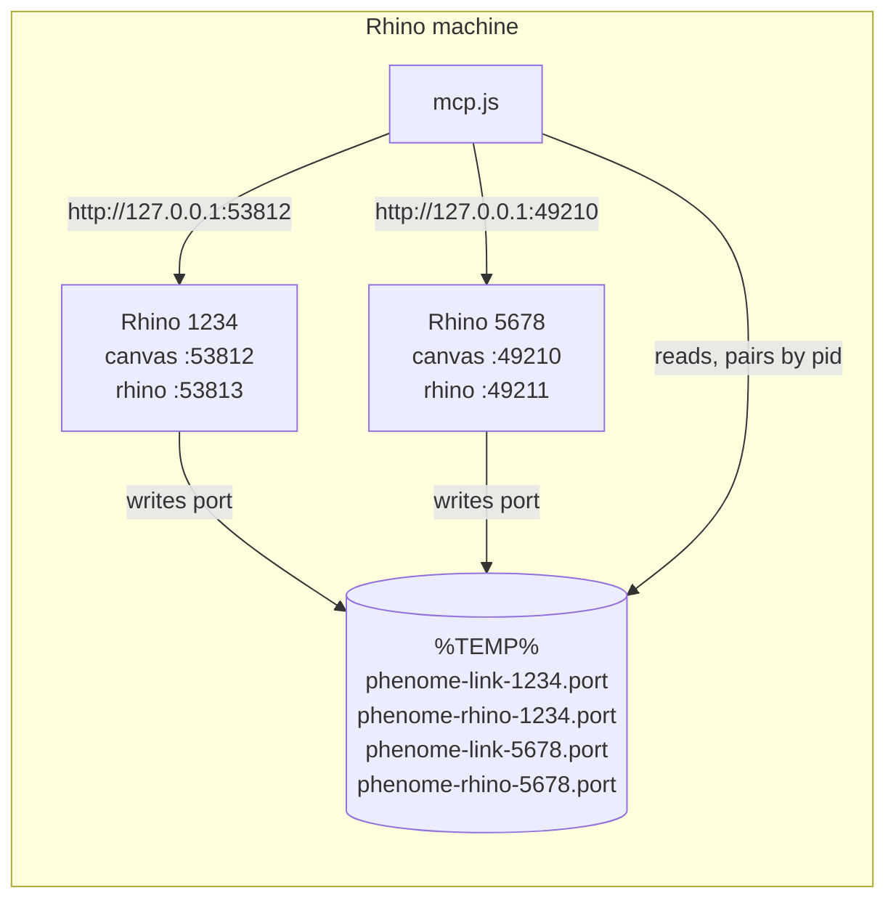
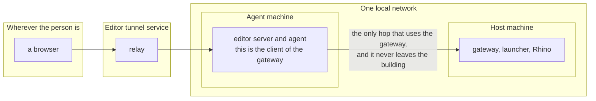
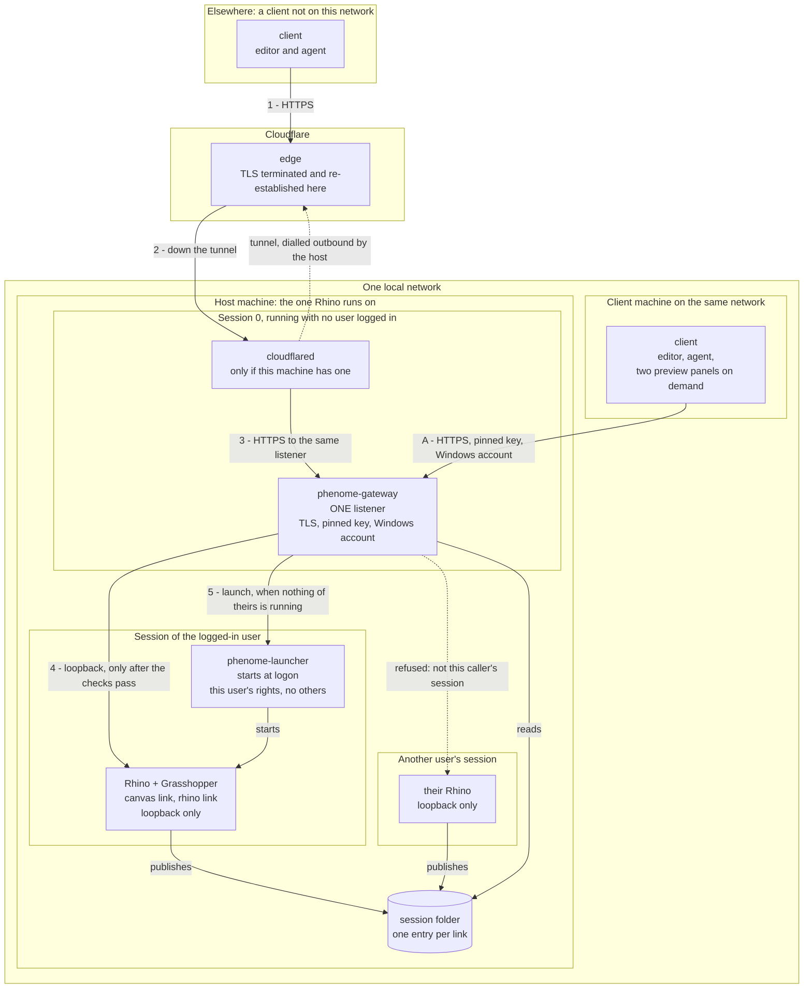
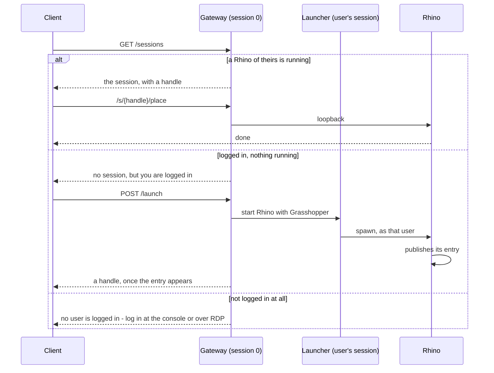
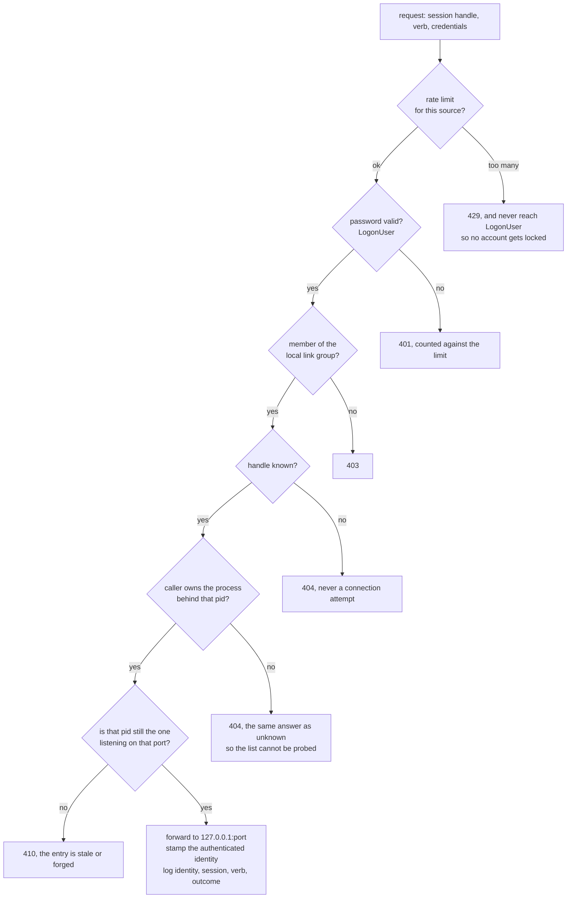

# Driving a canvas on another machine

This is a design note and describes nothing that ships. As of 0.31.0 the link is loopback only. The note
holds the plan for reaching a Rhino from a different machine and the record of what was considered and
turned down.

**Nothing here changes the plugins that ship today.** A Rhino without the gateway installed and a client
without the new configuration both behave exactly as they do now, and the gateway is a separate download.

## What exists today

Three servers run, each on its own ephemeral loopback port, and each publishes that port in a file whose
**name carries the process id**. The client globs the files, probes each port, and pairs a canvas with the
Rhino of the same pid.


```mermaid
flowchart LR
    subgraph win["Rhino machine"]
        direction TB
        r1["Rhino 1234<br/>canvas :53812<br/>rhino :53813"]
        r2["Rhino 5678<br/>canvas :49210<br/>rhino :49211"]
        tmp[("%TEMP%<br/>phenome-link-1234.port<br/>phenome-rhino-1234.port<br/>phenome-link-5678.port<br/>phenome-rhino-5678.port")]
        mcp["mcp.js"]
    end

    r1 -- "writes port" --> tmp
    r2 -- "writes port" --> tmp
    mcp -- "reads, pairs by pid" --> tmp
    mcp -- "http://127.0.0.1:53812" --> r1
    mcp -- "http://127.0.0.1:49210" --> r2
```

Every option below was judged on whether it keeps two properties of this arrangement. **There is no
coordinator**: sessions do not know about each other, and a Rhino that starts or dies changes nothing for
the others. **Authentication is the loopback interface**: nothing checks who is calling, because nothing
outside the machine can call.

## The other discovery path, a push

The diagram above covers only one half of discovery. The other half is the push path described here, and
that half is the one that matters for a remote setup.

Clicking the pair widget runs `Process.Start` on `vscode://phenome.phenome-link/pair?port=NNNN`, with the
template held in the Grasshopper setting `PhenomeLink:PairUri`. Windows resolves the protocol handler, VS
Code wakes, and `handleUri` sets the port, resets the journal cursor and opens a terminal with
**`PHENOME_GH_PORT` in its environment** and the handshake prompt already typed. That variable binds the
agent's MCP server to the canvas whose button was pressed instead of to whichever session answers first.

**This path cannot cross machines, by construction.** `Process.Start` on a `vscode://` URI opens the editor
on the machine that ran it. `EnsureExtension` acts only locally as well: it passes the bundled `.vsix` to the
local VS Code. A canvas on one machine cannot open an editor on another by launching a URI.

Remote pairing therefore starts from the client side: the user connects from their own editor, asks what is
running on that host, and picks a session. The local half of that picker exists since 0.33.0; see
*A session picker* below.

## The constraints that shape everything

**A URL reservation names one port.** On Windows, `HttpListener` binding a prefix other than loopback needs
either an elevated process or `netsh http add urlacl`. Rhino does not run elevated and should not. Ephemeral
ports cannot be reserved in advance, because their numbers are not known until something binds them.
Whatever listens on the network therefore has to be a process other than Rhino, on a fixed port, installed
deliberately.

**A service runs in session 0.** Its `%TEMP%` is `C:\Windows\Temp`, a different directory from the temp
directory of the user running Rhino. A machine-wide place to publish sessions is therefore a required part
of the design.

**The plugin is published, and it runs on networks its authors do not control.** The design assumes no
Cloudflare, no Entra and no trustworthy local network, and it avoids a heavy install. Anything that depends
on the authors' own topology belongs in configuration.

**Local work must survive a dead internet connection.** A canvas on one machine and an agent on the next one
must keep working when the line to the outside is down. This requirement rules out an external identity
provider as the only way in.

## The design

The design adds a gateway process, separate from Rhino. It runs with or without a logged-in user, owns
fixed ports and forwards to the loopback servers, which do not change at all.

The machine a component runs on determines its identity, its transport, and what happens when the link goes
down.

The primary arrangement is drawn first because it is the common case and is simpler than the general case:
**a remote user does not talk to the gateway at all.**


```mermaid
flowchart LR
    subgraph away["Wherever the person is"]
        br["a browser"]
    end

    subgraph relay["Editor tunnel service"]
        vsr["relay"]
    end

    subgraph lan2["One local network"]
        subgraph agentbox["Agent machine"]
            ag["editor server and agent<br/>this is the client of the gateway"]
        end
        subgraph hostbox["Host machine"]
            gw2["gateway, launcher, Rhino"]
        end
    end

    br --> vsr
    vsr --> ag
    ag -->|"the only hop that uses the gateway,<br/>and it never leaves the building"| gw2
```

The person's connection ends at the agent machine. From there the client is a process on the same network as
Rhino and reaches the gateway locally, with no internet in the path. This picture needs exactly what the
design asks of the local route: that it keep working when the line is down, and that it authenticate
against the machine itself.

The general case below adds one more way of arriving, for a client that is **not** on this network: a
laptop somewhere else running its own editor, driving the host directly.

This case is secondary and costs nothing to support. With one listener, it amounts to `cloudflared` pointed
at the address the local clients already use, which is one line in a tunnel configuration and no code in the
gateway. No second path has to be written, no second policy has to be kept correct, and nothing is deferred
to a later version.


```mermaid
flowchart TB
    subgraph far["Elsewhere: a client not on this network"]
        rc["client<br/>editor and agent"]
    end

    subgraph cfz["Cloudflare"]
        edge["edge<br/>TLS terminated and re-established here"]
    end

    subgraph lan["One local network"]
        subgraph lanbox["Client machine on the same network"]
            lc["client<br/>editor, agent,<br/>two preview panels on demand"]
        end

        subgraph host["Host machine: the one Rhino runs on"]
            subgraph s0["Session 0, running with no user logged in"]
                cfd["cloudflared<br/>only if this machine has one"]
                gw["phenome-gateway<br/>ONE listener<br/>TLS, pinned key, Windows account"]
            end

            subgraph inter["Session of the logged-in user"]
                helper["phenome-launcher<br/>starts at logon<br/>this user's rights, no others"]
                r1["Rhino + Grasshopper<br/>canvas link, rhino link<br/>loopback only"]
            end

            subgraph inter2["Another user's session"]
                r2["their Rhino<br/>loopback only"]
            end

            folder[("session folder<br/>one entry per link")]
        end
    end

    rc -->|"1 - HTTPS"| edge
    cfd -.->|"tunnel, dialled outbound by the host"| edge
    edge -->|"2 - down the tunnel"| cfd
    cfd -->|"3 - HTTPS to the same listener"| gw

    lc -->|"A - HTTPS, pinned key, Windows account"| gw

    gw -->|"4 - loopback, only after the checks pass"| r1
    gw -->|"5 - launch, when nothing of theirs is running"| helper
    helper -->|"starts"| r1
    gw -. "refused: not this caller's session" .-> r2

    r1 -- publishes --> folder
    r2 -- publishes --> folder
    gw -- reads --> folder
```

The diagram shows four things. **There is one listener and one policy**: a request that arrives through the
tunnel gets no extra trust and proves who it is exactly as a request from the next room does. **The tunnel
is dialled outbound by the host**, which means nothing is exposed and no port is forwarded. **The Rhino
links never leave the host**: they bind loopback exactly as they do today, and only a process on the same
machine talks to them. **At arrow 5 the gateway starts nothing itself**: it asks a helper that is already
running as the user, and no network-facing service ever holds the right to create processes as another
user.

The dotted refusal is the authorisation rule and is intended: a caller reaches the sessions they own and no
others.

### What the answer is, in each of the three states


```mermaid
sequenceDiagram
    participant C as Client
    participant G as Gateway (session 0)
    participant H as Launcher (user's session)
    participant R as Rhino

    C->>G: GET /sessions

    alt a Rhino of theirs is running
        G-->>C: the session, with a handle
        C->>G: /s/{handle}/place
        G->>R: loopback
        R-->>C: done
    else logged in, nothing running
        G-->>C: no session, but you are logged in
        C->>G: POST /launch
        G->>H: start Rhino with Grasshopper
        H->>R: spawn, as that user
        R->>R: publishes its entry
        G-->>C: a handle, once the entry appears
    else not logged in at all
        G-->>C: no user is logged in - log in at the console or over RDP
    end
```

In the third branch no service can create an interactive session. The answer is a sentence telling the
caller what to do, because an empty list would leave a user or an agent to work it out and guess wrong.

### What crosses each boundary

| boundary | what travels | identity checked | with the internet down |
|---|---|---|---|
| elsewhere to Cloudflare | HTTPS | none yet, the edge only carries | dead, and that is fine |
| Cloudflare to host | the existing tunnel | none, the tunnel is the credential | dead |
| cloudflared to gateway | HTTPS on loopback, key pinned | **Windows account, `LogonUser`** | dead |
| network client to gateway | HTTPS, key pinned | **Windows account, `LogonUser`** | **works** |
| gateway to a Rhino link | loopback HTTP | none, same as today | works |
| Rhino to the session folder | a file | filesystem ACL, create-file and read-own | works |

Collapsing the two listeners into one makes rows three and four check the same thing. Row four is
the case the whole arrangement exists for: two machines on one switch that depend on nothing outside the
building.

### What the gateway checks, in order


```mermaid
flowchart TB
    req["request: session handle, verb, credentials"]
    g1{"rate limit<br/>for this source?"}
    g2{"password valid?<br/>LogonUser"}
    g3{"member of the<br/>local link group?"}
    g4{"handle known?"}
    g5{"caller owns the process<br/>behind that pid?"}
    g6{"is that pid still the one<br/>listening on that port?"}
    ok["forward to 127.0.0.1:port<br/>stamp the authenticated identity<br/>log identity, session, verb, outcome"]

    req --> g1
    g1 -->|"too many"| deny1["429, and never reach LogonUser<br/>so no account gets locked"]
    g1 -->|ok| g2
    g2 -->|no| deny2["401, counted against the limit"]
    g2 -->|yes| g3
    g3 -->|no| deny3["403"]
    g3 -->|yes| g4
    g4 -->|no| deny4["404, never a connection attempt"]
    g4 -->|yes| g5
    g5 -->|no| deny5["404, the same answer as unknown<br/>so the list cannot be probed"]
    g5 -->|yes| g6
    g6 -->|no| deny6["410, the entry is stale or forged"]
    g6 -->|yes| ok
```

Two of those steps exist because the gateway must not believe what a session entry says. The **pid check**
exists because the `user` field in a session entry is written by the plugin running as that user and is
therefore a claim, while the owner of the process is not. The **port check** exists because the port number
in the entry is a claim as well. Without it, a local attacker can publish an entry pointing at a port they
control.

The rate limit comes **before** `LogonUser`, and failed attempts therefore cannot be used to lock a person
out of their own machine. An unauthorised session answers exactly as an unknown one does, which keeps the
inventory from being probed from outside.

### One listener, one policy

An earlier draft had two listeners: a network listener with a Windows account, and a loopback one for the
tunnel that would accept a signed assertion from the edge instead. With it, working from far away would have
cost one login instead of two.

The loopback listener was dropped. It cannot tell cloudflared from any other process on the machine, because
**loopback carries no identity**, and trusting it means trusting every local process. The verifier would
also have been optional, which makes running without one a default: a tunnel pointed at an unconfigured
gateway would expose remote code execution to the internet with nothing visibly broken.

There is one listener, and a request arriving down a tunnel is believed no more than any other. `cloudflared`
forwards to it like any other client, over TLS, and the user at the far end logs in with a Windows account.

| | |
|---|---|
| who reaches it | anything that can route to the machine, tunnel included |
| identity | a Windows account, `LogonUser`, plus membership of a local group |
| TLS | required, self-signed, the client pins the key |
| URL reservation | one, at install |
| with the internet down | works, because the account is resolved on the machine itself |

The cost is the single sign-on that the edge could have provided. From far away a user passes the tunnel's
own gate, if the owner configured one, and then the gateway's. In return there is one policy to reason about
instead of two, and no path that can be left open by omission.

### Two endpoints

```
GET  /sessions             -> the caller's own sessions in full, plus a count of everyone else's
ANY  /s/{handle}{verb}     -> forwarded to the session behind that handle
```

**The handle is issued by the gateway**, is unguessable, and maps to a port inside the gateway. A port
number never travels on the wire for a caller to substitute, and a request for a port the gateway did not
offer cannot even be expressed.

`/sessions` shows other people's work as a number and nothing else. The number tells a caller that the
machine is busy and says nothing about who is on it or what they have open.

### Machine registration and login

A password cannot be what carries a session. An agent runs for hours with no user at the keyboard, `mcp.js`
is a server on a pipe with no way to prompt, and any credential with an expiry eventually stops work in the
middle of it. The same failure ruled out an external identity provider, and a token of the gateway's own
would have brought it back.

**The arrangement follows SSH.** The client generates a key pair on first run. Registering a machine is one
command in which a person gives an account and a password, over TLS, once: the gateway checks `LogonUser`,
checks the group, and stores the **public** key against that Windows account. From then on the gateway
offers a challenge, the client signs it, and a short-lived token carries the working session. The client
keeps the equivalent of `known_hosts`, the gateway keeps the equivalent of `authorized_keys`, and there is no
new concept to learn.

Compared with a bearer credential, **the gateway holds nothing that can be used to impersonate a user.** A
leak of its store is a leak of public keys. Revocation is per machine: one entry is removed, no password
changes and no other user is disturbed. The password crosses the wire exactly once in the life of a client
instead of once per session.

**The signature is not the whole check.** An account can be disabled or dropped from the group after it was
registered. Membership and the account's standing are therefore re-checked every time a token is issued as
well as at registration. Without that, the key store would silently become a second set of permissions
alongside Windows and drift from it, which is the problem choosing Windows accounts was meant to avoid.

A private key sitting unencrypted on the client is a credential at rest, guarded by file permissions and
nothing else, as it is with SSH. For an unattended agent the unencrypted key is intended, and the
documentation should state it so that nobody has to discover it.

The gateway never logs the credential header, never puts a request into an exception message, and clears
the buffer after the check. State this in the code at the place it matters, because a later change made in a
hurry can put the leak back.

**The rate limit sits in front of `LogonUser`.** Failed attempts count against Windows account lockout. With
the limit behind it, a client that can reach the machine could lock a user out of their own account, at the
console as well. For the same reason the documentation recommends a dedicated local account for this instead
of the one used to log in every morning.

Membership of a local group created at install is a condition alongside the password. The existence of an
account is not evidence that its owner was ever meant to drive Rhino, and a machine that has been in use for
years has accounts of no clear origin.

### Limits

One cap applies to requests in flight across the whole gateway, and the excess is refused, not queued. The
cap protects the service's own threads and sockets, the only part of this a caller can exhaust. Beyond that,
a flood reaches only the flooder's own sessions and freezes their Rhino and no other user's.

The protocol says that no answer at all tells the client nothing about whether the work ran. A queue that
silently lengthens the wait is worse than a refusal a client can act on.

TLS on that listener is required on every network, however safe it seems. The credential is **a Windows
account password**, and the plugin ships to people whose networks its authors know nothing about.

### The certificate, and how it stays a one-time thing

The gateway makes its own certificate at install and the client pins it. A naive implementation would make
"one-time" mean "every year, on every client", and three decisions keep it to once.

**Pin the public key, not the certificate.** A certificate expires and a key need not. Renewing on the same
key leaves the pin unchanged, and no client notices. With the whole certificate pinned, every renewal on the
gateway would be a change every machine had to be told about, once a year.

**Let the pin replace hostname verification.** The machine can then be reached as `something.local` today
and by a private-network name tomorrow, or be renamed outright, without touching the certificate, and this
one decision removes two problems.

**Keep the key across upgrades.** The installer generates a key only when it finds none. Without that rule,
the first update would break trust on every client at once.

On the client the pattern is SSH's, which users already know. The first connection shows the fingerprint and
asks, then stores it beside the configuration and says nothing further. A changed key produces a prominent
warning, as with `known_hosts`, and never a silent downgrade.

| what | how often |
|---|---|
| generating the key, binding it to the port | once per host, at install |
| confirming the fingerprint | once per client, on first connection |
| renewing the certificate | invisible, same key |
| renaming the machine, adding a private network | nothing to do |
| upgrading the gateway | nothing, as long as the key is kept |
| a leaked private key | deliberate replacement, and every client confirms again |

Only the last row requires action, which is correct for a leaked key.

A machine behind a tunnel gets no second listener: *One listener, one policy* above explains why the
loopback listener of the earlier draft was dropped.

### Three rules the proxy must follow

All three come from `docs/protocol.md`.

**Never retry.** No answer at all says nothing about whether the work ran, because work is queued onto
Rhino's UI thread and abandoning the wait cannot unqueue it. A proxy that retries a dropped socket can run
an edit twice.

**Do not impose a shorter timeout than the client's.** A slow solve holds the UI thread and a verb can
legitimately take a long time. The gateway carries the wait for as long as the client does and does not cut
it short.

**Stream the body.** `screenshot` and `canvas-image` answer with a base64 PNG. Streamed, its size is limited
by the client's patience and by no buffer size.

### Where sessions are published

Sessions are published in one machine-wide folder, `C:\ProgramData\Phenome\sessions\`, with an ACL that lets
users write and the gateway read.

**The plugin cannot guarantee that folder exists.** It runs unelevated, and a machine-wide directory with an
ACL is created once with administrator rights. The folder is therefore a *consequence of installing the
gateway* and no precondition of the plugin. The plugin writes there when the folder exists and is writable
and falls back to `%TEMP%` otherwise, and clients read both. A machine with no gateway behaves exactly as it
does today and needs no special handling.

Because several users' sessions now share one folder, the entry carries more than a pid: **kind, pid, port,
Windows session id and user**. Today the name carries the pid, which was enough while the folder was
per-user.

**All of those are claims, and none of them decides anything.** The entry is written by the plugin running
as the user, and a local attacker can write whatever they like into one. Ownership is established from the
owner of the process behind the pid, the port is confirmed against the system's own record of which process
is listening on it, and the fields serve only for display.

**The folder grants create-file, and read only to the owner.** Per-user temp directories were an incidental
boundary, and pooling them would otherwise give every user an inventory of everyone else's live links. The
gateway reads everything by system right; a local client reads its own entries, the only ones it uses. No
user may delete or modify another user's entry, reparse points are refused when reading, and an entry that
does not parse is treated as absent and not interpreted.

**Publish to both places for one release.** Parts are upgraded at different times, and a newer plugin with an
older extension is a normal state. One release writes both and reads both; the next drops `%TEMP%`. Skipping
this step breaks pairing for users who will have no idea why.

### A session picker

Since 0.33.0 the editor can choose between local canvases. *Phenome Link: Switch Canvas*, also on a click on
the status bar, lists the live sessions with their document name, port and Rhino pid, and pins the chosen
one until it stops answering. `handleUri` sets the port the widget sent, and `mcp.js` has a `sessions` verb
and honours `PHENOME_GH_PORT`. What remote work still needs is the same list across machines, with each
session's kind and user.

Remote work needs it, because nobody is sitting at the remote canvas to press its buttons, and it is worth
having locally with two Rhinos open.

### Seeing what is on the other machine

Through a tunnel, the canvas is on a machine the user cannot see. The protocol already handles this and
needs nothing added: **`canvas_image`** returns the canvas as a picture fitted to the document, and
**`screenshot`** returns the active Rhino viewport as a PNG, framed on the geometry with the camera put
back where the user left it.

The editor's half exists since 0.33.0: **two panels, one per picture**, each with its own refresh. The two
are kept separate so that whichever one is being watched can take the screen.

**The panels refresh on demand, never live.** Both verbs run on Rhino's single UI thread, and a panel that
refreshed itself would take time from the user on that machine. A manual refresh button is the correct
behaviour.

This works over a tunnel without any special handling, because the extension runs on the remote machine and
the picture is rendered by the browser at the other end.

### Client configuration

Both variables are unset by default, and unset means today's behaviour.

| variable | meaning |
|---|---|
| `PHENOME_LINK_HOST` | set, and discovery goes to a gateway instead of reading local files |
| `PHENOME_LINK_PORT` | gateway port |

Neither the credential nor the pinned key is configuration. The password is asked for and cached by the
client; the key is remembered on first connection, in a file of the client's own, the way `known_hosts`
works.

### Starting Rhino from somewhere else

`phenome__launch` spawns a process on the machine the client runs on and means nothing anywhere else. An
earlier draft left remote launch out of scope for that reason and then for a second one: the only way to do
it inside the gateway was to give a network-facing service the privilege to create processes as other
users, on the strength of a request that arrived over the network, and the threat model exists to avoid
exactly that.

**A small per-user helper resolves it.** It starts at logon and runs with that user's rights and no others.
The gateway asks it to launch and launches nothing itself.

> **Measured, and it works.** A scheduled task with an interactive logon type stands in for the helper: Rhino
> starts, Grasshopper opens, and the canvas link announces a port within about six seconds. This holds with
> the session connected and with it parked, and with another Rhino running and with none. Launching Rhino
> without the interactive user's own hands causes no problem, and the helper is feasible.
>
> **The argument form decides whether a canvas opens.** `/runscript="_Grasshopper"` opens one and
> `"/runscript=_Grasshopper"` silently does not, which looks exactly like Rhino being slow. `docs/protocol.md`
> and the pairing notes recommended the second form, and `launch` in `mcp.js` does not use it. The code was
> right and the documentation was wrong: following the documentation gave a Rhino with no canvas and no way
> to tell why. Both pages are corrected.
>
> Two related findings:
>
> - A force-killed Rhino loses whatever plug-in registration it was holding. A plug-in used to detect the
>   session then stops being loaded with no visible cause.
> - `taskkill` without `/F` **cannot** reach a window across a session boundary (Windows answers that the
>   process can only be terminated forcefully). The same command run as a scheduled task inside the session
>   closes Rhino properly in two seconds. That is the way to close it without the user, and it is worth
>   knowing before reaching for `/F`.

- the gateway keeps its virtual account and gains no privilege at all
- the Rhino that starts belongs to the user, not to a service
- it extends the rule already in place: a caller reaches their own sessions and starts their own Rhino
- with no user logged in there is no helper, and the answer **log in first**, at the console or over RDP,
  follows from the structure and needs no special case

No service, with or without a helper, can create an interactive session where none exists.

### Reporting the next step

`/sessions` distinguishes three states: a Rhino of the caller's is running; the caller is logged in but
nothing is running; the caller is not logged in at all. An empty list would leave the caller to guess. The
last two states call for different advice, "start Rhino" in one and "log in at the machine first" in
the other, and a client that cannot tell them apart gives the reader, whether a user or an agent, the wrong
one.

### A non-Windows client

The host is Windows because Rhino runs on Windows. The client need not be, and in the arrangement this was
designed for it is not: the agent and the model sit on a Linux machine and the canvas is on the Windows one.

**This is why the credential is Basic under TLS and not one of the native Windows schemes.** Negotiate and
NTLM would have been the obvious choice for a Windows host, but Node speaks neither, and a plain header works
everywhere. Basic is therefore a requirement and not a compromise.

Name resolution was verified on the Linux machine: `avahi` is running, `nsswitch` resolves through
`mdns4_minimal`, and the Windows hosts on the network answer by name. The lookup returns an IPv4 address,
and the IPv6-first behaviour that has to be worked around from Windows does not arise on this machine.

Everything else is ordinary HTTP (the login, the token, the session list, the forwarded verbs and the file
of remembered keys), and three details need care.

**Pinning without a dependency.** `fetch` cannot easily be pointed at a private certificate without reaching
into `undici`, and this extension has no dependencies on purpose. `node:https` takes a certificate and
exposes the peer's, and `node:crypto` hashes the key; both are built into Node. The order matters: with
verification switched off, `checkServerIdentity` is never called and the pin silently stops being checked,
and the code should carry a comment saying so.

**The shape of a user name** was measured, not guessed, on a machine joined to Entra and not to a domain.

`LogonUser` accepts an Entra account, and **`LOGON32_LOGON_NETWORK` succeeds**; that is the logon type a
network service would use. Only one way of writing the name works:

| user name | domain | result |
|---|---|---|
| the UPN | none | fails, 1326 |
| **the UPN** | **`AzureAD`** | **succeeds, on all four logon types** |
| the part before the `@` | `AzureAD` | fails, 1326 |
| `AzureAD\` and the UPN, as one string | none | fails, 53 then 1326 |

`AzureAD` therefore goes in the **domain parameter** and is never glued to the name. Glued to the name, it
is read by Windows as a network domain, and error 53 reports the search for that domain.

All three wrong ways end in 1326 (the last after 53), "the user name or password is incorrect", while the password is
perfectly correct. That message costs hours of debugging, and the gateway should not simply pass it on.
When authentication fails, the name contains an `@` and no domain was supplied, the answer should say which
form to try, because an error message is the only documentation a user reads at the moment they need it.

**The encoding of a password.** Basic carries base64 of `user:password`, and both ends have to agree on
UTF-8. If they disagree, a password with an accented character works from one machine and not from another,
and the symptom looks like a wrong user name.

One limit cannot be fixed, only stated: **every verb that names a file means a path on the Windows
machine.** An agent running on Linux will reason about a disk it cannot see and build paths in its own
idiom. The warning belongs in the pairing notes, which are loaded into the agent's context, because no other
place reaches the agent at the moment it builds a path.

### Where the two cases differ

Both cases are supported and share the listener, the policy, the certificate and the client. Three things
differ between them, and all three are configuration with no code involved.

**The name.** A client on the network uses the machine's mDNS name. A client elsewhere uses whatever the
tunnel or the private network publishes. Because the pinned key replaces hostname verification, the same
remembered key serves both names, and a laptop that moves between them confirms the host only once.

**A laptop is in both cases on different days.** The client therefore takes **more than one name and tries
them in order**, with a short timeout on the earlier ones, and the first answer wins. At home it lands on the
local name and gets the fast path; in a hotel it falls through to the tunnel. Measured on the pair of
machines this was designed for, the difference is 159 ms against 621 ms for the same call, which makes the
order significant.

**Trusting the origin through the tunnel.** `cloudflared` reaches a gateway that presents a self-signed
certificate and has to be given that certificate with `caPool`. `noTLSVerify` is not used: the hop may be
short and local, but switching verification off is a habit that spreads to places where the hop is neither.

### Addressing, which is not this design's problem

`PHENOME_LINK_HOST` takes a name. On a local network mDNS already supplies one. From outside, a private
network such as Tailscale gives a stable name from anywhere without publishing anything, a tunnel gives a
public one, and the gateway works the same with any of them. Optionally it can advertise itself over DNS-SD,
and a client on the same network can then browse for machines instead of being told a name.

### Distribution

**The gateway ships outside the yak package, in the same release and with the same version number.** It is
a zip holding the executable and its install and uninstall scripts, built by CI and attached beside the
`.gha`, the `.rhp` and the `.vsix`. A user who does not want it does not download it.

The shared number states a fact about the code and is no convenience: the gateway reads session files by
calling the same shared `Sessions` that writes them, which makes it one of the parts that only work
together. `build.ps1` already states that about the three. A release cycle of its own would allow patching
the gateway without releasing plugins, at the cost of a compatibility table someone would have to maintain,
and a table between two artefacts sharing a file format is the kind of debt that surfaces six months later.

The install script is one elevated run: create the session folder with its ACL, create the local group and
put the installing user in it, register the service, add the URL reservation, generate and bind the
certificate, open the firewall for the private profile only.

**The service runs as a virtual account**, `NT SERVICE\phenome-gateway`, and the URL reservation names that
account and nothing broader: a reservation granted to a wide group lets any local user bind the prefix while
the service is stopped and serve their own content on it. The virtual account is the least privilege that
can do the job. Before declaring success, the install verifies that it can read another user's process
owner and the system's table of listening sockets, because both are needed and neither is guaranteed at that
privilege.

**Audit goes to the Windows event log**, under a source of its own: identity, session, verb, outcome.
Rotation, permissions and collection by whatever a company already runs then work with no code written for
them, and the account that generated the entries cannot remove them without leaving a trace.

**The executable is not signed.** Releases publish SHA-256 sums and build provenance, which trace a file to
the workflow run and the commit that produced it. The install instructions state plainly that Windows will
warn about an unknown publisher on first run. A code signing certificate costs a few hundred a year and adds
another secret to CI. For a deliberate, separate download that trade is not worth making, and it should be
revisited if the gateway ever reaches a wider audience. Nothing in the instructions ever tells a user to turn
a protection off.

Three points in the existing workflow affect the gateway, and the workflow already states exactly how each
part fails:

- **The version check names its subjects one by one.** `build.yml` checks that five declarations agree and
  states in a comment that an unnamed project is not checked and ships with whatever number it had. The
  gateway will be the sixth.
- **The release body holds the install instructions**, and it currently tells people to look in
  `%TEMP%\phenome-link-<pid>.port`. After the session folder change that is only half true, and the release
  body is the first thing a new user reads.
- **The SharePoint job selects by extension** (`.gha`, `.rhp`, `.vsix`) and would skip a zip.

An unsigned executable that installs a Windows service will meet SmartScreen and whatever antivirus the
user runs. For a separate, deliberate download that is acceptable. It is also the reason the gateway should
not be pushed at people who only wanted a Grasshopper plugin.

## Prerequisite cleanup

When this was written, the convention the gateway depends on was a string literal written six times in two
languages, and the loopback address appeared fourteen times. The table lists what changes before a fourth consumer joins.

| idea | today | after |
|---|---|---|
| where a session publishes itself | 6 literals, C# and JS | `Sessions` in Shared, mirrored once in JS |
| the loopback address | 14 occurrences | one constant, one base-URL helper |
| find a session and call a verb | 2 copies, `mcp.js` and `extension.js` | one module both use |
| headers a client must send | 2 copies, and 0.32.0 had to edit both | the same module |
| bind, accept, read, respond | 3 copies, 1032 lines | `LinkHost` in Shared, optional |

The first three are on the critical path, because the gateway reads session files by calling the same code
that writes them instead of reimplementing the convention a seventh time. `LinkHost` is independent debt,
worth addressing for its own reasons, and skipping it changes nothing here.

**One easily missed constraint decides how the client module is shipped.** `mcp.js` is imported here and is
also **copied into the user's workspace** as `.phenome/gh-mcp.js`, and five different host registries are
written pointing `node` at that one file. It therefore has to stay runnable on its own. Extracting a module
means the copier carries two files instead of one, and every workspace paired before the change keeps a copy
with no module beside it until that workspace is paired again. The content-type change had to be written
around the same version skew, and here the stale copy sits on someone else's disk with nothing to remind
them.

There are **no tests** in this repository, and at this blast radius that is the main risk. Each step is
therefore followed by the same manual pass: pair from the widget, port on the status bar, `place` and `wire`
and `peek`, the `events` cursor, `screenshot`, `launch` with no session, and two Rhinos at once confirming
`PHENOME_GH_PORT` binds the right canvas. The last check matters most, because it covers the only failure
that is silent.

Release the tidying on its own, with no user-visible change, and the gateway after it. A regression can then
be bisected to one of the two releases without guessing.

## Considered and not chosen

**A gateway inside Rhino** would be owned by whichever process binds the port first, with the others
retrying on a timer. This needs a coordinator where the design deliberately had none, and the failure has no
obvious signal: close the Rhino that happens to own the port and every remote client loses the link while
the canvases are still running.

**A reserved port range and no gateway** would have the servers bind the network directly in a special mode.
That keeps the shape of the system, but it puts network code, a credential check and a bind decision into
three plugins that ship to everyone whether they want the feature or not.

**A shared token generated per machine** would invent an identity system beside the one every Windows
machine already has, and give none of what that one gives: password policy, lockout, an event log,
revocation by disabling an account.

**An external identity provider as the only way in** is the simplest to build and solves several problems
at once, but it makes work between two machines on the same switch depend on a service on another continent.
An outage at the wrong moment locks a person out of the machine in the next room.

## What this does not attempt

**There is one credential per user and no delegation.** A user authenticates as that Windows account, and
whoever authenticates acts as that account.

**Paths stay local to Rhino.** Every verb that names a file means a path on the Rhino machine. A client
elsewhere is reasoning about a disk it cannot see.

**Sessions are not created.** If no user is logged in there is no canvas to reach, and the gateway says so
instead of automating a logon. Starting Rhino inside a session that already exists is a different matter and
is in scope; see *Starting Rhino from somewhere else*.

**There is no read-only mode for now.** It was considered and left out. Code execution is what the link is
for, and a mode that serves the reading verbs is no boundary against a caller who has an account and is in
the group. It would be a convenience, and its cost is a classification of every verb that has to be kept
correct forever. The question is worth revisiting when a real case for it appears, and not in anticipation
of one.

## Open

- **Half measured.** An Entra account authenticates through `LogonUser`, on every logon type including
  `NETWORK`, provided the name is written the one way that works (see above). What is still unknown is
  whether it does so **with the cable pulled**: the machine holds cached credentials, but whether a network
  logon consults them or asks Entra has not been established. If it asks Entra, the local path stops working
  in exactly the outage it exists for, and a local account has to sit beside the Entra one.
- Whether `LinkHost` is in scope or left as debt.
- The two port numbers.
